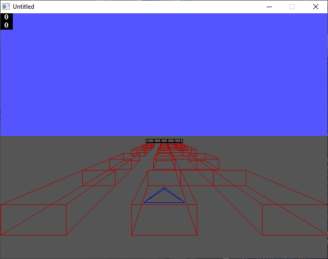

[Home](https://qb64.com) • [News](../../news.md) • [GitHub](https://github.com/QB64Official/qb64) • [Wiki](https://github.com/QB64Official/qb64/wiki) • [Samples](../../samples.md) • [InForm](../../inform.md) • [GX](../../gx.md) • [QBjs](../../qbjs.md) • [Community](../../community.md) • [More...](../../more.md)

## SAMPLE: DRUG3D



### Author

[🐝 Kevin B. Kohler](../kevin-b.-kohler.md) 

### Description

```text
PRINT "      Canibal Gopher inc. presents "
PRINT "          Drug Runner 3d demo"
PRINT "           Demo version 1.00      "
PRINT "        Copyright Kevin B. Kohler "
PRINT "                  1998            "
PRINT
PRINT
PRINT "            Arrow keys move"
PRINT
PRINT "              Escape quits"
PRINT
PRINT "              Space jumps"
```

### QBjs

> Please note that QBjs is still in early development and support for these examples is extremely experimental (meaning will most likely not work). With that out of the way, give it a try!

* [LOAD "drug3d.bas"](https://qbjs.org/index.html?src=https://qb64.com/samples/drug3d/src/drug3d.bas)
* [RUN "drug3d.bas"](https://qbjs.org/index.html?mode=auto&src=https://qb64.com/samples/drug3d/src/drug3d.bas)
* [PLAY "drug3d.bas"](https://qbjs.org/index.html?mode=play&src=https://qb64.com/samples/drug3d/src/drug3d.bas)

### File(s)

* [drug3d.bas](src/drug3d.bas)

🔗 [game](../game.md), [3d](../3d.md), [legacy](../legacy.md)
