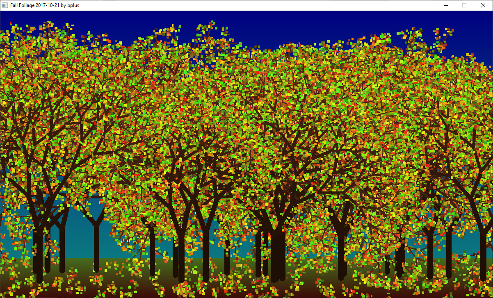

[Home](https://qb64.com) • [News](../../news.md) • [GitHub](https://github.com/QB64Official/qb64) • [Wiki](https://github.com/QB64Official/qb64/wiki) • [Samples](../../samples.md) • [InForm](../../inform.md) • [GX](../../gx.md) • [QBjs](../../qbjs.md) • [Community](../../community.md) • [More...](../../more.md)

## SAMPLE: FALL FOLIAGE



### Author

[🐝 bplus](../bplus.md) 

### Description

```text
Where were we? Oh Ashish was doing fractals and his last was a marvelous 3D Tree but I thought it a bit bare so I will show how to do leaves. :) maybe then he can make them 3D too!
```

### QBjs

> Please note that QBjs is still in early development and support for these examples is extremely experimental (meaning will most likely not work). With that out of the way, give it a try!

* [LOAD "fallfoliage.bas"](https://qbjs.org/index.html?src=https://qb64.com/samples/fall-foliage/src/fallfoliage.bas)
* [RUN "fallfoliage.bas"](https://qbjs.org/index.html?mode=auto&src=https://qb64.com/samples/fall-foliage/src/fallfoliage.bas)
* [PLAY "fallfoliage.bas"](https://qbjs.org/index.html?mode=play&src=https://qb64.com/samples/fall-foliage/src/fallfoliage.bas)

### File(s)

* [fallfoliage.bas](src/fallfoliage.bas)

🔗 [zen](../zen.md)


<sub>Reference: [qb64forum](https://qb64forum.alephc.xyz/index.php?topic=71.0) </sub>
