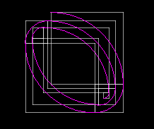
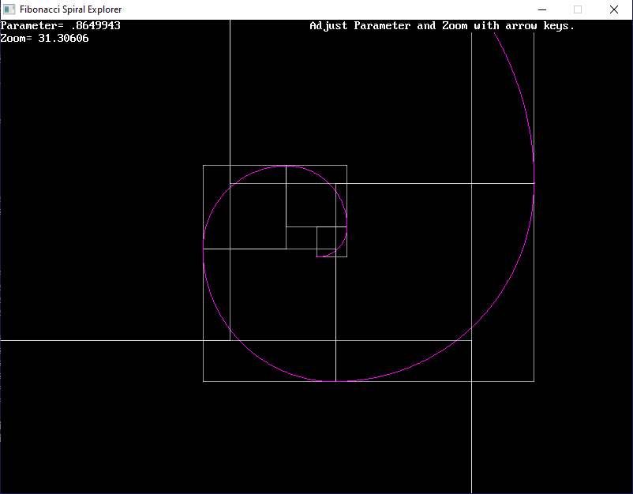

[Home](https://qb64.com) • [News](../../news.md) • [GitHub](../../github.md) • [Wiki](../../wiki.md) • [Samples](../../samples.md) • [Media](../../media.md) • [Community](../../community.md) • [Rolodex](../../rolodex.md) • [More...](../../more.md)

## SAMPLE: FIBONACCI VARIATIONS



### Author

[🐝 STxAxTIC](../stxaxtic.md) 

### Description

```text
The Fibonacci sequence is "seeded" with the golden ratio, but what if we change that?
```

### File(s)

* [myofsequ.bas](src/myofsequ.bas)
* [myofspir.bas](src/myofspir.bas)

### Additional Image(s)



🔗 [fibonacci](../fibonacci.md), [spiral](../spiral.md)


<sub>Reference: [qb64forum](https://qb64forum.alephc.xyz/index.php?topic=3370.0) </sub>
