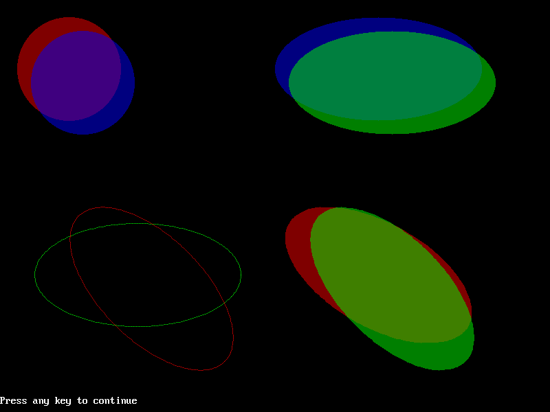

[Home](https://qb64.com) • [News](../../news.md) • [GitHub](https://github.com/QB64Official/qb64) • [Wiki](https://github.com/QB64Official/qb64/wiki) • [Samples](../../samples.md) • [InForm](../../inform.md) • [GX](../../gx.md) • [QBjs](../../qbjs.md) • [Community](../../community.md) • [More...](../../more.md)

## SAMPLE: FILLED CIRCLES AND ELLIPSES



### Author

[🐝 QB64 Team 2018](../qb64-team-2018.md) 

### Description

```text
We develop four variations on the CIRCLE command in the form of four SUBs:
(i) CircleFill = Filled circle
(ii) EllipseFill = Filled ellipse
(iii) EllipseTilt = Tilted ellipse
(iv) EllipseTiltFill = Tilted and filled ellipse

These works have been optimized for speed and respect for alpha transparency.
```

### QBjs

> Please note that QBjs is still in early development and support for these examples is extremely experimental (meaning will most likely not work). With that out of the way, give it a try!

* [LOAD "ellipses.bas"](https://qbjs.org/index.html?src=https://qb64.com/samples/filled-circles-and-ellipses/src/ellipses.bas)
* [RUN "ellipses.bas"](https://qbjs.org/index.html?mode=auto&src=https://qb64.com/samples/filled-circles-and-ellipses/src/ellipses.bas)
* [PLAY "ellipses.bas"](https://qbjs.org/index.html?mode=play&src=https://qb64.com/samples/filled-circles-and-ellipses/src/ellipses.bas)

### File(s)

* [ellipses.bas](src/ellipses.bas)

🔗 [filled circle](../filled-circle.md), [ellipse](../ellipse.md)


<sub>Reference: [qb64forum](https://qb64forum.alephc.xyz/index.php?topic=4213.0) </sub>
