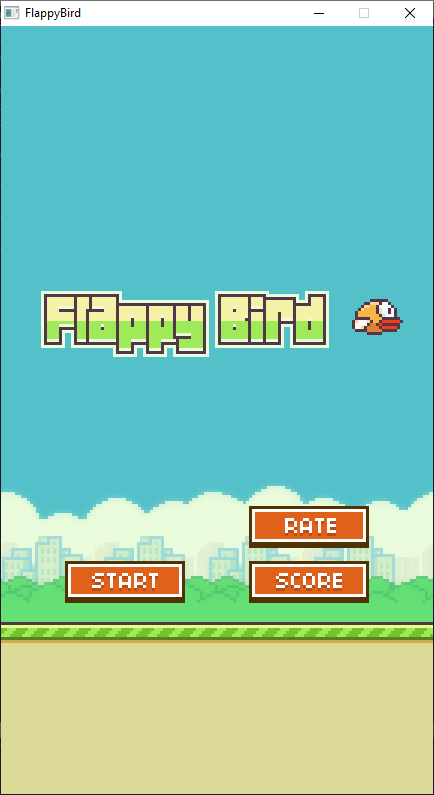

[Home](https://qb64.com) • [News](../../news.md) • [GitHub](../../github.md) • [Wiki](../../wiki.md) • [Samples](../../samples.md) • [Media](../../media.md) • [Community](../../community.md) • [Rolodex](../../rolodex.md) • [More...](../../more.md)

## SAMPLE: FLAPPY BIRD



### Author

[🐝 Terry Ritchie](../terry-ritchie.md) 

### Description

```text
' -----------------------------------------------
' QB64 FlappyBird Clone by Terry Ritchie 02/28/14
'
' This program was created to accompany the QB64
' Game Programming course located at:
' http://www.qb64sourcecode.com
'
' You may not sell or distribute this game! It
' was made for instructional purposes only.
' -----------------------------------------------
```

### QBjs

> Please note that QBjs is still in early development and support for these examples is extremely experimental (meaning will most likely not work). With that out of the way, give it a try!

* [LOAD "fbird.bas"](https://v6p9d9t4.ssl.hwcdn.net/html/5963335/index.html?src=https://qb64.com/samples/flappy-bird/src/fbird.bas)
* [RUN "fbird.bas"](https://v6p9d9t4.ssl.hwcdn.net/html/5963335/index.html?mode=auto&src=https://qb64.com/samples/flappy-bird/src/fbird.bas)
* [PLAY "fbird.bas"](https://v6p9d9t4.ssl.hwcdn.net/html/5963335/index.html?mode=play&src=https://qb64.com/samples/flappy-bird/src/fbird.bas)

### File(s)

* [fbird.bas](src/fbird.bas)
* [fbird.zip](src/fbird.zip)

🔗 [game](../game.md), [flappy bird](../flappy-bird.md)
