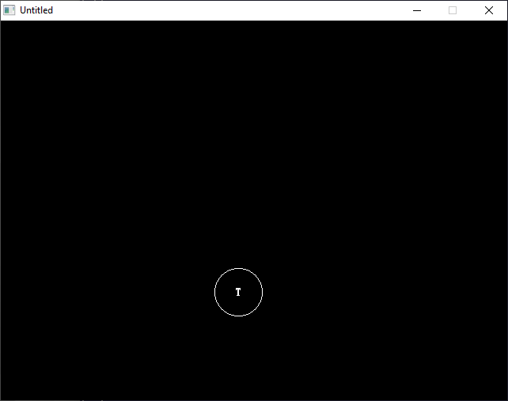

[Home](https://qb64.com) • [News](../../news.md) • [GitHub](https://github.com/QB64Official/qb64) • [Wiki](https://github.com/QB64Official/qb64/wiki) • [Samples](../../samples.md) • [InForm](../../inform.md) • [GX](../../gx.md) • [QBjs](../../qbjs.md) • [Community](../../community.md) • [More...](../../more.md)

## SAMPLE: FLIP



### Author

[🐝 Tom Sales](../tom-sales.md) 

### Description

```text
Copyright (C) 1994-95 DOS Resource Guide/DOS World 
Published in Issue #17, September 1994, page 66 and 
              Issue #20, March 1995, page 64 
 
It takes clever programming indeed to create an 
interesting one-line program. You'll be amazed at 
how much can be accomplished. 

ESP.BAS and FLIP.BAS both revolve around the flip of a coin. In FLIP.BAS, you  
see a coin tossed into the air. When it lands, the program displays an H or a  
T to let you know the outcome of the toss (Heads or Tails). Think of this  
program as an executive decision maker: Heads, you leave work early; tails,  
you stay until quitting time. 

ESP.BAS, in contrast, takes a statistical approach. It prompts you to guess  
an H or a T, tells you the outcome of the toss (Heads or Tails), displays the  
total number of YES (correct) and NO (incorrect) responses, and tells you  
your score (the percentage of correct guesses).
```

### QBjs

> Please note that QBjs is still in early development and support for these examples is extremely experimental (meaning will most likely not work). With that out of the way, give it a try!

* [LOAD "flip.bas"](https://qbjs.org/index.html?src=https://qb64.com/samples/flip/src/flip.bas)
* [RUN "flip.bas"](https://qbjs.org/index.html?mode=auto&src=https://qb64.com/samples/flip/src/flip.bas)
* [PLAY "flip.bas"](https://qbjs.org/index.html?mode=play&src=https://qb64.com/samples/flip/src/flip.bas)

### File(s)

* [flip.bas](src/flip.bas)

🔗 [statistics](../statistics.md), [dos world](../dos-world.md), [254 chars](../254-chars.md)
