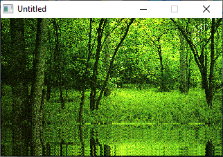

[Home](https://qb64.com) • [News](../../news.md) • [GitHub](https://github.com/QB64Official/qb64) • [Wiki](https://github.com/QB64Official/qb64/wiki) • [Samples](../../samples.md) • [InForm](../../inform.md) • [GX](../../gx.md) • [QBjs](../../qbjs.md) • [Community](../../community.md) • [More...](../../more.md)

## SAMPLE: FOREST



### Author

[🐝 Antoni Gual](../antoni-gual.md) 

### Description

```text
A forest scene with rippling reflecting water

'FOREST.BAS by Antoni Gual
'For the Future Software 2002 7 liner contest
'NOTE: Data lines did not count by the rules of THAT contest.
'----------------------------------------------------------------------------
```

### QBjs

> Please note that QBjs is still in early development and support for these examples is extremely experimental (meaning will most likely not work). With that out of the way, give it a try!

* [LOAD "forest.bas"](https://qbjs.org/index.html?src=https://qb64.com/samples/forest/src/forest.bas)
* [RUN "forest.bas"](https://qbjs.org/index.html?mode=auto&src=https://qb64.com/samples/forest/src/forest.bas)
* [PLAY "forest.bas"](https://qbjs.org/index.html?mode=play&src=https://qb64.com/samples/forest/src/forest.bas)

### File(s)

* [forest.bas](src/forest.bas)

🔗 [data manipulation](../data-manipulation.md), [7 lines](../7-lines.md), [legacy](../legacy.md)
