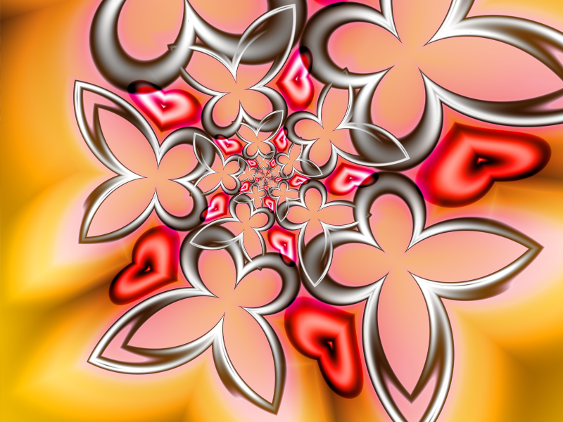
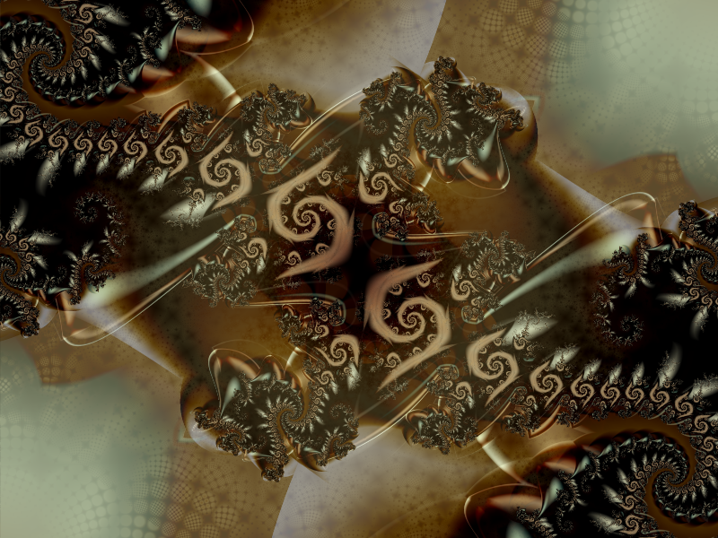
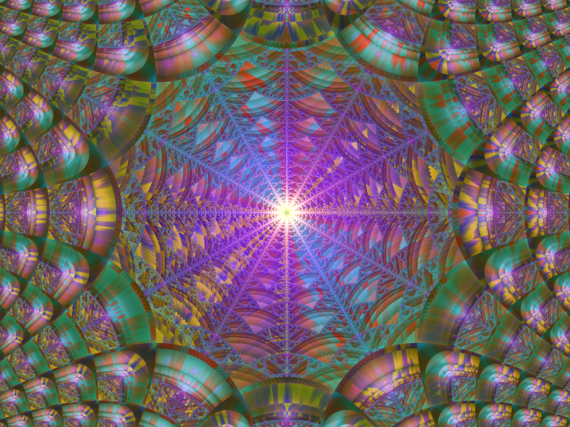
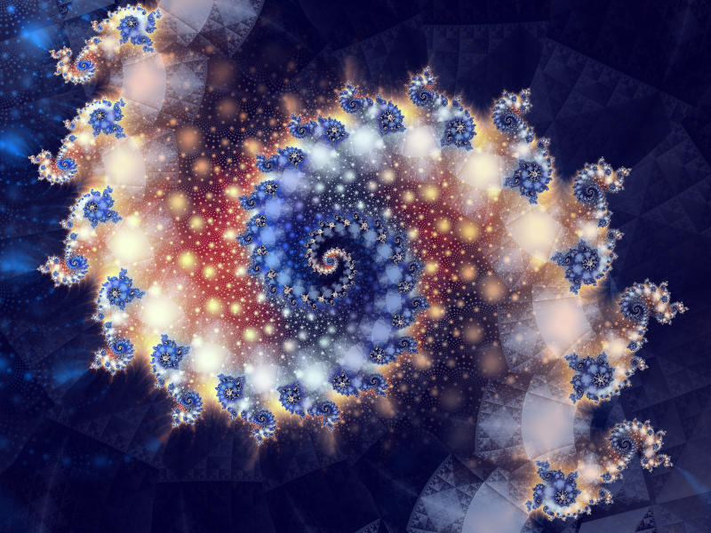

[Home](https://qb64.com) • [News](../../news.md) • [GitHub](https://github.com/QB64Official/qb64) • [Wiki](https://github.com/QB64Official/qb64/wiki) • [Samples](../../samples.md) • [InForm](../../inform.md) • [GX](../../gx.md) • [QBjs](../../qbjs.md) • [Community](../../community.md) • [More...](../../more.md)

## SAMPLE: FRACTAL ART



### Author

[🐝 Zom-B](../zom-b.md) 

### Description

```text
This is [...] a series of fractal artworks that I ported from Ultra Fractal to Quick Basic 4.5 with the Future library, and are currently upgrading to QB64. I received permission from the author(s) of the artworks to republish their works in this particular form. The original consists of a lot of include and routine files $included in the main, which I have merged here for convenience.
```

### File(s)

* [hearts-and-butterflies.bas](src/hearts-and-butterflies.bas)
* [interestingspiral2.bas](src/interestingspiral2.bas)
* [sierpinsky-rays+aet.bas](src/sierpinsky-rays+aet.bas)
* [the-burning-of-julia2.1.bas](src/the-burning-of-julia2.1.bas)

### Additional Image(s)





🔗 [fractal](../fractal.md), [art](../art.md)


<sub>Reference: [qb64forum](https://qb64forum.alephc.xyz/index.php?topic=173.0) </sub>
