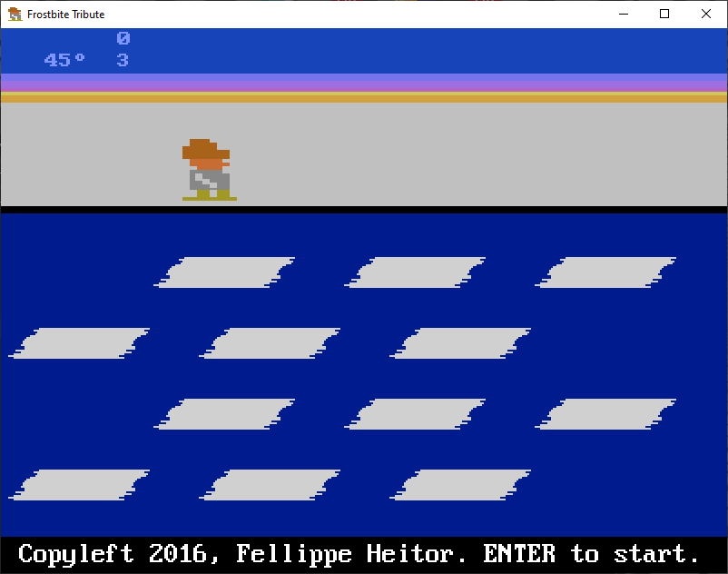

[Home](https://qb64.com) • [News](../../news.md) • [GitHub](https://github.com/QB64Official/qb64) • [Wiki](https://github.com/QB64Official/qb64/wiki) • [Samples](../../samples.md) • [InForm](../../inform.md) • [GX](../../gx.md) • [QBjs](../../qbjs.md) • [Community](../../community.md) • [More...](../../more.md)

## SAMPLE: FROSTBITE



### Author

[🐝 Fellippe Heitor](../fellippe-heitor.md) 

### Description

```text
A clone of Frostbite for the Atari 2600, originally designed by Steve Cartwright and published by Activision in 1983. Written in QB64.
```

### QBjs

> Please note that QBjs is still in early development and support for these examples is extremely experimental (meaning will most likely not work). With that out of the way, give it a try!

* [LOAD "frostbite.bas"](https://qbjs.org/index.html?src=https://qb64.com/samples/frostbite/src/frostbite.bas)
* [RUN "frostbite.bas"](https://qbjs.org/index.html?mode=auto&src=https://qb64.com/samples/frostbite/src/frostbite.bas)
* [PLAY "frostbite.bas"](https://qbjs.org/index.html?mode=play&src=https://qb64.com/samples/frostbite/src/frostbite.bas)

### File(s)

* [frostbite.bas](src/frostbite.bas)
* [frostbite.zip](src/frostbite.zip)

🔗 [game](../game.md), [frostbite](../frostbite.md)


<sub>Reference: [github.com](https://github.com/FellippeHeitor/frostbite) </sub>
