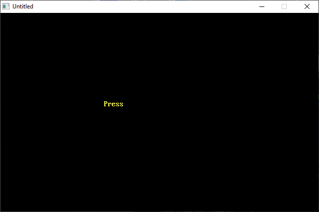

[Home](https://qb64.com) • [News](../../news.md) • [GitHub](https://github.com/QB64Official/qb64) • [Wiki](https://github.com/QB64Official/qb64/wiki) • [Samples](../../samples.md) • [InForm](../../inform.md) • [GX](../../gx.md) • [QBjs](../../qbjs.md) • [Community](../../community.md) • [More...](../../more.md)

## SAMPLE: FUNSUBS



### Author

[🐝 Jon Mark O'Connor](../jon-mark-o'connor.md) 

### Description

```text
' FUNSUBS.BAS
' by Dennis Mull and Tina Sweet
' Copyright (C) 1994 DOS World
' Published in Issue #18, November 1994, page 54

***************************************************************************** 
 
 FUNSUBS.BAS 
 LIB.BAS 
   by Dennis Mull and Tina Sweet 
 Copyright (C) 1994 DOS World 
 Published in Issue #18, November 1994, page 54 
 
FUNSUBS.BAS contains four attention-grabbing subroutines that you can add to  
your own QBasic programs to create special visual and sound effects. The  
second program, LIB.BAS, aids you in merging the subroutines from FUNSUBS.BAS  
into your own programs. 
 
To run FUNSUBS.BAS, which shows you a demonstration of the special effects,  
change to the directory containing FUNSUBS.BAS, then type: 
 
QBASIC /RUN FUNSUBS 
 
 
Within FUNSUBS.BAS the MARQUEEPAUSE section creates fancy borders that blink  
like the lights on a movie marquee sign; TICKPRINT and TICKERTAPE print  
messages on your screen; and DOSOUND lets you add sound effects to your  
programs. 
 
FUNSUBS.BAS puts MARQUEEPAUSE through its paces first. To keep things simple,  
the program displays a short message surrounded by a border composed of  
asterisks. The routine turns on each of the asterisks in the border in  
sequence and then turns each one off, just as the light bulbs in a marquee  
switch on and off. You may substitute another character for the asterisk by  
changing the value of the variable CH%. (See the table "Program Variables,"  
below.) For example, to use a "happy face" in the marquee's border, alter the  
variable's value by changing CH% = 42 to CH% = 1, the ASCII value for the  
happy-face symbol. 
 
Use MARQUEEPAUSE to print a border anywhere on screen simply by assigning the  
proper values to the QBasic variables you pass to the subprogram as  
parameters. 
 
Suppose you want to display the following message for five seconds at the  
start of your program: 
 
Copyright Dennis Mull & Tina Sweet 
Version 1.1 
All rights reserved. 
 
To clear the screen and place the message in row 11, column 23, you'd start  
by adding a CLS statement and three LOCATE statements: 
 
CLS 
LOCATE 11, 23, 0: PRINT "Copyright Dennis Mull & Tina Sweet" 
LOCATE 12, 23, 0: PRINT "Version 1.1" 
LOCATE 13, 23, 0: PRINT "All rights reserved." 
 
You'd then set the values for MARQUEEPAUSE and call the subroutine: 
 
CH% = 42: BKCLR% = 14: CHCLR% = 14: ROW% = 9 
COL% = 21: WIDE% = 55: HIGH% = 6: TOUT! = 5 
MARQUEEPAUSE CH%, BKCLR%, CHCLR%, ROW%, COL%, WIDE%, HIGH%, TOUT! 
 
TICKPRINT and TICKERTAPE are variations on a theme. TICKPRINT displays a  
message in the center of the screen, printing it one character at a time from  
left to right, sounding a single "typewriter click" as each character is  
printed, clearing the screen, and starting over again. TICKERTAPE displays a  
message that scrolls its way from left to right, simultaneously sounding a  
click as each character appears. The message disappears when you press a key. 
 
You might use these routines in different ways--perhaps to focus attention on  
a short menu, a help screen, or a message to remind users that they must type  
something before the program can continue. 
 
As written, TICKPRINT and TICKERTAPE display yellow text on a black screen,  
but you can vary this by changing the values of CHCLR% and BKCLR%, the  
variables that control foreground and background color. (See the accompanying  
table "Color Values," below.) 
 
For example, you might color-code your messages, displaying error messages in  
red text on a white background and help messages in white text on a blue  
background. To set up the first color scheme under TICKPRINT, you'd change  
this line: 
 
TICKPRINT MESSAGE$, 12, 26, 5, 1, 0, 14 
 
to read as follows: 
 
TICKPRINT MESSAGE$, 12, 26, 5, 1, 7, 4 
 
To use the white-on-blue color scheme with TICKERTAPE, you'd change this  
line: 
 
TICKERTAPE MESSAGE$, 25, 6, 40, 0, 14 
 
to read: 
 
TICKERTAPE MESSAGE$, 25, 6, 40, 1, 7 
 
When you call TICKPRINT and use a value of zero for BKCLR%, the subroutine  
uses black as the background color, as you'd expect. When you set CHCLR% to  
zero, however, your message appears in a rainbow of colors. If you don't like  
that effect and would prefer black as a text color, disable this feature by  
deleting the following lines from TICKPRINT: 
 
IF CHCLR% = 0 THEN 
IF DOC% < 15 THEN DOC% = DOC% + 1 
 COLOR DOC%, BKCLR% 
 IF DOC% = 15 THEN DOC% = 0 
END IF 
 
Ticking isn't the only "music" FUNSUBS.BAS lets you make. The program's  
fourth subroutine, DOSOUND, demonstrates how to add whistles, bomb drops,  
beebops, and a siren to any message. These sounds have many uses: For  
example, imagine using a bomb drop or a siren to accompany an error message.  
Users would know right away that something had gone wrong. 
 
You choose a sound by initializing the parameter variable WHICHSND%, using a  
number from 1 to 4. The numbers correspond to those given in DOSOUND's CASE  
statement for each sound. You may also tell DOSOUND how many times you want  
it to make the sound by initializing the variable HOWMANY%, using a value  
from 1 to 100. 
 
Another option is to use DOSOUND within a do...loop construction. In the  
following example, for instance, the sound will continue until the user  
presses a key: 
 
WHICHSND% = 1: HOWMANY% = 1 
DO 
  DOSOUND WHICHSND%, HOWMANY% 
  A$ = "": A$ = INKEY$ 
LOOP WHILE A$ = "" 
 
You can add your own sounds to DOSOUND. To do this, load FUNSUBS.BAS into  
QBasic. If you're at the DOS command line, change to the directory containing  
FUNSUBS.BAS, then type: 
 
qbasic funsubs 
 
When you press the F2 key, QBasic will display a list of the subroutines in  
FUNSUBS.BAS. Highlight the subroutine DOSOUND and press Enter. When QBasic  
displays DOSOUND, use the down-arrow key to move the cursor to the beginning  
of the line that reads END SELECT, then press Enter. Type the code for the  
new sound in the blank space you created. For example, if you want to add a  
snippet of arcade "music" to your sound repertoire, insert these lines: 
 
CASE 5 
   FOR X = 1 TO 20 STEP 2 
    SOUND 150 * X, .7 
   NEXT X 
   FOR X = 30 TO 1 STEP -2 
    SOUND 50 * X, .7 
   NEXT X 
 
Save your work. Press F2 and Enter to switch back to the program's main  
module. Move the cursor down to this statement: 
 
LOCATE 12, 35: PRINT "       " 
 
and press Enter again. Insert the following line into the listing: 
 
DOSOUND 5, 1: SLEEP 1 
 
To test the new sound, press Shift+ F5 to run the program again. 
 
 
We're confident you can dream up many uses for these versatile subroutines.  
And the best part is that you won't have to do much typing to incorporate our  
ideas into your code, because we've included a short program, LIB.BAS, which  
merges the subroutines in FUNSUBS.BAS with another QBasic program. 
 
Before running LIB.BAS, make sure it and FUNSUBS.BAS are in the same  
directory and that you change to that directory. When you run LIB.BAS, it  
asks you to type the name of the program to which you want to add the  
FUNSUBS.BAS subroutines. (If that program isn't in the current directory, you  
may include a directory name.) When you type in the name of your program and  
press Enter, LIB.BAS merges the FUNSUBS.BAS routines with your program and  
saves the combined program as a file named TEMP.BAS. 
 
You should immediately load TEMP.BAS into QBasic and use QBasic's Save As  
command to save TEMP.BAS under a different name to avoid overwriting it the  
next time you use LIB.BAS. You may use the name of the program to which  
you're adding FUNSUBS.BAS, which overwrites the old version of that program,  
or choose a new filename.) 
 
After adding FUNSUBS.BAS to another program, delete any sections of  
FUNSUBS.BAS you don't need. First, press F2 to see a list, then highlight the  
name of the subroutine to delete and press Alt+D. Delete any other routines  
you don't need, then press F2 and Enter to return to the main module. If you  
delete any of the FUNSUBS.BAS routines in this way, you should also go to the  
beginning of the program and delete the corresponding declare statements. 
 
You may want to take the precaution of storing a backup copy of FUNSUBS.BAS  
in a safe place. 
 
 
PROGRAM VARIABLES 
 
Variable    Range of Values           Description 
--------    ---------------           ----------- 
BKCLR%      0-15                      background color 
CH%         1-6; 8; 14-27; 33-254     ASCII value of character 
                                        used in marquee border 
CHCLR%      1-15                      foreground color 
COL%        1-78                      column to begin printing 
DELAY!      1-100                     length of delay to adjust 
                                         scrolling or printing speed 
HIGH%       1-23                      height of border 
HOWMANY%    1-100                     number of times to sound 
MESSAGE$    1-79                      message to print 
ROW%        1-25                      row to begin printing 
SND%        0 or 1                    turn sound off (0) and on (1) 
TOUT!       1-100                     elapsed time (in seconds) before 
                                        MARQUEEPAUSE ends 
WHICHSND%   1-4                       number of CASE statement  
                                        for desired sound 
WIDE%       2-16                      width of marquee border  
 
 
 
COLOR VALUES 
 
  Number    Color              Number     Color 
  ------    -----              ------     ----- 
    0*      black                 8       dark gray 
    1       blue                  9       light blue 
    2       green                10       light green 
    3       cyan                 11       light cyan 
    4       red                  12       light red 
    5       magenta              13       light magenta 
    6       brown                14       yellow 
    7       white                15       bright white 
 
*In the version of TICKPRINT provided here, selecting a value of zero for a  
foreground color tells the routine to display text in a rainbow of colors.
```

### File(s)

* [funsubs.bas](src/funsubs.bas)
* [lib.bas](src/lib.bas)

🔗 [graphics](../graphics.md), [dos world](../dos-world.md)
