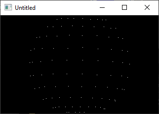

[Home](https://qb64.com) • [News](../../news.md) • [GitHub](https://github.com/QB64Official/qb64) • [Wiki](https://github.com/QB64Official/qb64/wiki) • [Samples](../../samples.md) • [InForm](../../inform.md) • [GX](../../gx.md) • [QBjs](../../qbjs.md) • [Community](../../community.md) • [More...](../../more.md)

## SAMPLE: GLOBE



### Authors

[🐝 Jeh](../jeh.md) [🐝 Yu](../yu.md) 

### Description

```text
Glen Jeh, 8/12/1994, William Yu (05-28-96)

'{A little rotating sphere, by Glen Jeh, 8/12/1994, use freely}
'{Try messing with the constants...code is squished a little}
' Converted to BASIC by William Yu (05-28-96)
```

### QBjs

> Please note that QBjs is still in early development and support for these examples is extremely experimental (meaning will most likely not work). With that out of the way, give it a try!

* [LOAD "globe.bas"](https://qbjs.org/index.html?src=https://qb64.com/samples/globe/src/globe.bas)
* [RUN "globe.bas"](https://qbjs.org/index.html?mode=auto&src=https://qb64.com/samples/globe/src/globe.bas)
* [PLAY "globe.bas"](https://qbjs.org/index.html?mode=play&src=https://qb64.com/samples/globe/src/globe.bas)

### File(s)

* [globe.bas](src/globe.bas)

🔗 [3d](../3d.md), [sphere](../sphere.md)
