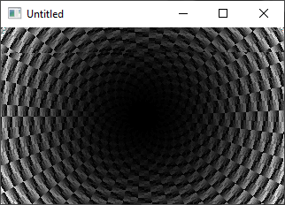

[Home](https://qb64.com) • [News](../../news.md) • [GitHub](../../github.md) • [Wiki](../../wiki.md) • [Samples](../../samples.md) • [Media](../../media.md) • [Community](../../community.md) • [Rolodex](../../rolodex.md) • [More...](../../more.md)

## SAMPLE: GUJERO2



### Author

[🐝 Antoni Gual](../antoni-gual.md) 

### Description

```text
'-----------------------------------------------------------------------
'GUJERO2.BAS by Antoni Gual 2/2004
'For the QBNZ 1/2004 9 liner contest
'-----------------------------------------------------------------------
'Tunnel effect (more or less)
'FFIX recommended. It does compile.
'-----------------------------------------------------------------------
```

### File(s)

* [gujero.bas](src/gujero.bas)

🔗 [screensaver](../screensaver.md), [tunnel](../tunnel.md)
