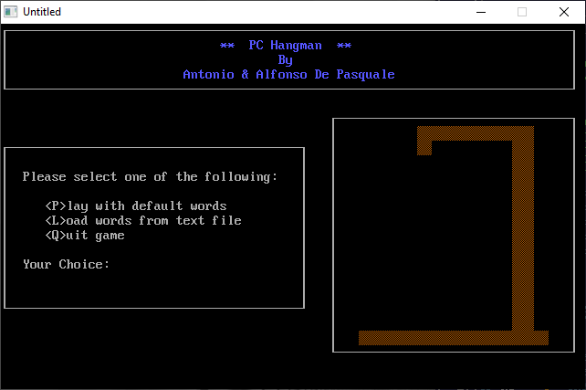

[Home](https://qb64.com) • [News](../../news.md) • [GitHub](https://github.com/QB64Official/qb64) • [Wiki](https://github.com/QB64Official/qb64/wiki) • [Samples](../../samples.md) • [InForm](../../inform.md) • [GX](../../gx.md) • [QBjs](../../qbjs.md) • [Community](../../community.md) • [More...](../../more.md)

## SAMPLE: HANGMAN



### Author

[🐝 A&A De Pasquale](../a&a-de-pasquale.md) 

### Description

```text
'  HANGMAN.BAS by Antonio & Alfonso De Pasquale
'  Copyright (C) 1993, 1994 DOS Resource Guide
'  Published in Issue #14, March 1994

==============================================================================

-------------
 HANGMAN.BAS
-------------
SYSTEM REQUIREMENTS:
The version of QBasic that comes with DOS 5 or later.

WHAT HANGMAN.BAS DOES:
Hangman is a classic computer word game that has been played on machinery 
ranging from the largest mainframe computer to the smallest programmable 
calculator.  HANGMAN.BAS implements the game in QBasic.

The object of the game is to determine what word that the computer is 
"thinking of" by guessing letters one at a time.  Each incorrect guess brings 
you one step closer to the hangman's noose.  After six incorrect guesses, 
you're "hung," and you lose the game.

USING HANGMAN.BAS:
To load the program in QBasic, type QBASIC HANGMAN.BAS (using path names if 
necessary) at the DOS prompt. Then run the program by selecting the Start 
option in QBasic's Run menu, or press Shift-F5. You'll be asked if you wish to 
play the game with a default word list provided by the program or with a word 
list of your own creation.  Either way, you'll be shown the length of the 
mystery word and asked to start guessing the letters it contains.  Each time 
you guess incorrectly, the "body" hanging from the graphical gallows on the 
right side of the display will grow: First the head will appear, then the 
torso, followed by the arms, then the legs.  If the hanging body is fully 
formed before you have guessed the word, you lose!

For further details on HANGMAN.BAS, see DRG #14, March 1994.
```

### QBjs

> Please note that QBjs is still in early development and support for these examples is extremely experimental (meaning will most likely not work). With that out of the way, give it a try!

* [LOAD "hangman.bas"](https://qbjs.org/index.html?src=https://qb64.com/samples/hangman/src/hangman.bas)
* [RUN "hangman.bas"](https://qbjs.org/index.html?mode=auto&src=https://qb64.com/samples/hangman/src/hangman.bas)
* [PLAY "hangman.bas"](https://qbjs.org/index.html?mode=play&src=https://qb64.com/samples/hangman/src/hangman.bas)

### File(s)

* [hangman.bas](src/hangman.bas)

🔗 [game](../game.md), [hangman](../hangman.md), [dos world](../dos-world.md)
