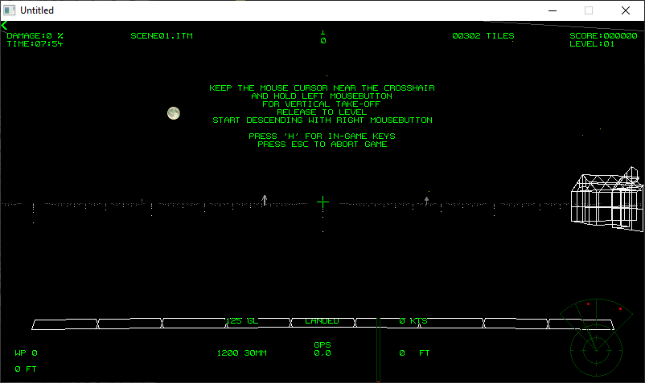

[Home](https://qb64.com) • [News](../../news.md) • [GitHub](https://github.com/QB64Official/qb64) • [Wiki](https://github.com/QB64Official/qb64/wiki) • [Samples](../../samples.md) • [InForm](../../inform.md) • [GX](../../gx.md) • [QBjs](../../qbjs.md) • [Community](../../community.md) • [More...](../../more.md)

## SAMPLE: HELICOPTER RESCUE



### Author

[🐝 TrialAndTerror](../trialandterror.md) 

### Description

```text
=================================================================================
		       H E L I C O P T E R   R E S C U E  v2.23
=================================================================================
	Run 'Helicopter Rescue.exe' for menu screen
		
	Mouse:		Left button ................ Collective up
			Right button ............... Collective down
			Mouse movement ............. Cyclic
	
	Keyboard:	'A' ........................ Collective up
			'Z' ........................ Collective down
			Arrow keys ..................Cyclic 	
        
	Keys in menu:	'ESC' ... Exit to system
			'+' ..... Soundlevel up
			'-' ..... Soundlevel down
	
	Keys in game:	'SPC' ... Fire cannon
			'H' ..... Help
			'M' ..... Show map		
			'.' ..... Next waypoint (0 = base)
			',' ..... Previous waypoint 
			'R' ..... View rescues
			'S' ..... View supplies available at base
			'O' ..... View number of objects (trees etc.) remaining
			'G' ..... Hide/show coordinates	
			'Q' ..... Hide/show cursor
  			'B' ..... Hide/show rotor blades	
			'TAB' ... Toggle fullscreen
	                'C' ..... Toggle control type (mouse recommended)
			'I' ..... Invert control
			'P' ..... Pause
			'ESC' ... Abort game/replay    

	Keys in replay:	'-' ..... Slow down
			'+' ..... Speed up  

	Macro recording is only available in mouse-mode (mouse-logger).	
	Click in the text box in the menu screen to start the replay.

        For displays other than 1600x900 use [ALT] + [ENTER] to toggle through 
        the different fullscreen modes until the result is as desired or press
        [TAB] during flight to play in a windowed mode.

 	To uninstall the game delete the game-folder.
								v20210426 (c) T&T
=================================================================================
```

### File(s)

* [helicopter-rescue.zip](src/helicopter-rescue.zip)

🔗 [game](../game.md), [3d](../3d.md), [flight](../flight.md)


<sub>Reference: [qb64forum](https://qb64forum.alephc.xyz/index.php?topic=382) </sub>
