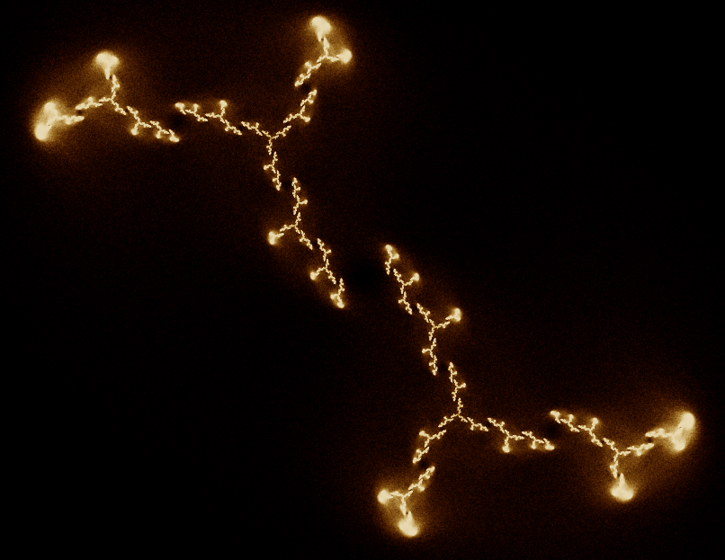

[Home](https://qb64.com) • [News](../../news.md) • [GitHub](https://github.com/QB64Official/qb64) • [Wiki](https://github.com/QB64Official/qb64/wiki) • [Samples](../../samples.md) • [InForm](../../inform.md) • [GX](../../gx.md) • [QBjs](../../qbjs.md) • [Community](../../community.md) • [More...](../../more.md)

## SAMPLE: INVERSE JULIA FRACTAL EXPLORER



### Author

[🐝 Zom-B](../zom-b.md) 

### Description

```text
The longer you hold your mouse at one position, the more it starts to glow.
```

### QBjs

> Please note that QBjs is still in early development and support for these examples is extremely experimental (meaning will most likely not work). With that out of the way, give it a try!

* [LOAD "inversejulia.bas"](https://qbjs.org/index.html?src=https://qb64.com/samples/inverse-julia-fractal-explorer/src/inversejulia.bas)
* [RUN "inversejulia.bas"](https://qbjs.org/index.html?mode=auto&src=https://qb64.com/samples/inverse-julia-fractal-explorer/src/inversejulia.bas)
* [PLAY "inversejulia.bas"](https://qbjs.org/index.html?mode=play&src=https://qb64.com/samples/inverse-julia-fractal-explorer/src/inversejulia.bas)

### File(s)

* [inversejulia.bas](src/inversejulia.bas)

🔗 [fractal](../fractal.md), [julia set](../julia-set.md)


<sub>Reference: [qb64forum](https://qb64forum.alephc.xyz/index.php?topic=1046.0) </sub>
