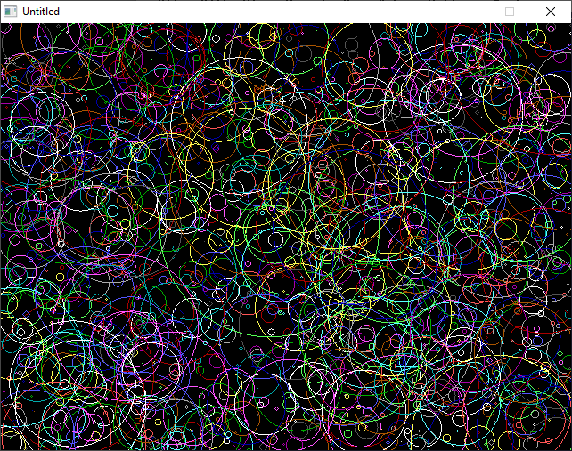

[Home](https://qb64.com) • [News](../../news.md) • [GitHub](https://github.com/QB64Official/qb64) • [Wiki](https://github.com/QB64Official/qb64/wiki) • [Samples](../../samples.md) • [InForm](../../inform.md) • [GX](../../gx.md) • [QBjs](../../qbjs.md) • [Community](../../community.md) • [More...](../../more.md)

## SAMPLE: INYRFACE



### Author

[🐝 Tom Sales](../tom-sales.md) 

### Description

```text
Copyright (C) 1994-95 DOS Resource Guide/DOS World 
Published in Issue #17, September 1994, page 66 and 
              Issue #20, March 1995, page 64 
 
It takes clever programming indeed to create an 
interesting one-line program. You'll be amazed at 
how much can be accomplished. 

INYRFACE.BAS displays a series of colored bubbles that grow steadily in size  
as the program works its way through a series of STEPS in a FOR...NEXT loop.   
When the program reaches the maximum value, it loops back to the beginning.
```

### QBjs

> Please note that QBjs is still in early development and support for these examples is extremely experimental (meaning will most likely not work). With that out of the way, give it a try!

* [LOAD "inyrface.bas"](https://qbjs.org/index.html?src=https://qb64.com/samples/inyrface/src/inyrface.bas)
* [RUN "inyrface.bas"](https://qbjs.org/index.html?mode=auto&src=https://qb64.com/samples/inyrface/src/inyrface.bas)
* [PLAY "inyrface.bas"](https://qbjs.org/index.html?mode=play&src=https://qb64.com/samples/inyrface/src/inyrface.bas)

### File(s)

* [inyrface.bas](src/inyrface.bas)

🔗 [screensaver](../screensaver.md), [dos world](../dos-world.md), [254 chars](../254-chars.md)
