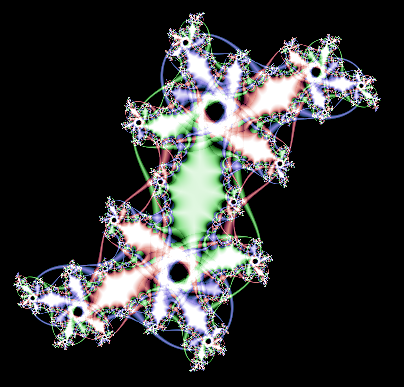

[Home](https://qb64.com) • [News](../../news.md) • [GitHub](../../github.md) • [Wiki](../../wiki.md) • [Samples](../../samples.md) • [Media](../../media.md) • [Community](../../community.md) • [Rolodex](../../rolodex.md) • [More...](../../more.md)

## SAMPLE: JULIA RINGS



### Author

[🐝 Relsoft](../relsoft.md) 

### Description

```text
Automated Julia set explorer.
```

### File(s)

* [juliarings.bas](src/juliarings.bas)

🔗 [fractal](../fractal.md), [julia set](../julia-set.md)


<sub>Reference: [qb64forum](https://qb64forum.alephc.xyz/index.php?topic=1045.0) </sub>
