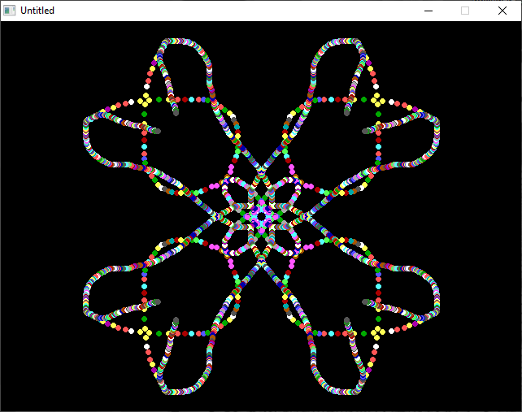

[Home](https://qb64.com) • [News](../../news.md) • [GitHub](https://github.com/QB64Official/qb64) • [Wiki](https://github.com/QB64Official/qb64/wiki) • [Samples](../../samples.md) • [InForm](../../inform.md) • [GX](../../gx.md) • [QBjs](../../qbjs.md) • [Community](../../community.md) • [More...](../../more.md)

## SAMPLE: KALEIDOSCOPE DOODLER



### Author

[🐝 qbguy](../qbguy.md) 

### Description

```text
Left-click to draw, right click or middle click to clear screen, escape to quit.
```

### QBjs

> Please note that QBjs is still in early development and support for these examples is extremely experimental (meaning will most likely not work). With that out of the way, give it a try!

* [LOAD "kaleid.bas"](https://qbjs.org/index.html?src=https://qb64.com/samples/kaleidoscope-doodler/src/kaleid.bas)
* [RUN "kaleid.bas"](https://qbjs.org/index.html?mode=auto&src=https://qb64.com/samples/kaleidoscope-doodler/src/kaleid.bas)
* [PLAY "kaleid.bas"](https://qbjs.org/index.html?mode=play&src=https://qb64.com/samples/kaleidoscope-doodler/src/kaleid.bas)

### File(s)

* [kaleid.bas](src/kaleid.bas)

🔗 [art](../art.md), [drawing](../drawing.md)
