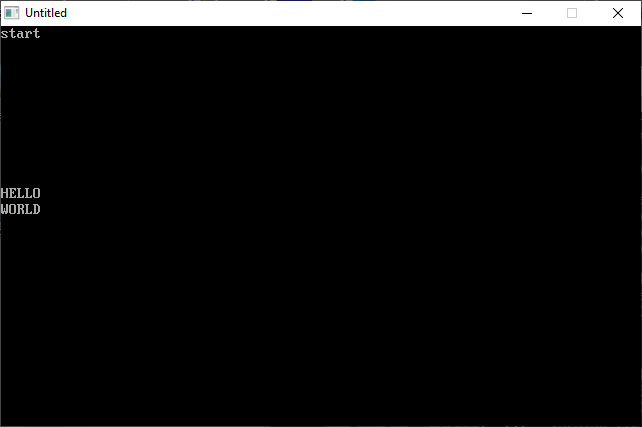

[Home](https://qb64.com) • [News](../../news.md) • [GitHub](https://github.com/QB64Official/qb64) • [Wiki](https://github.com/QB64Official/qb64/wiki) • [Samples](../../samples.md) • [InForm](../../inform.md) • [GX](../../gx.md) • [QBjs](../../qbjs.md) • [Community](../../community.md) • [More...](../../more.md)

## SAMPLE: KBDPARSE



### Author

[🐝 William W. Sindel](../william-w.-sindel.md) 

### Description

```text
'***************************************************************************
'*
'*  Keyboard input parsing routine
'*
'*  The idea here was to create a program that will capture input from the
'*  keyboard and convert it into a list of words as individual strings as
'*  the user enters text from the keyboard. Exit from the program occurs
'*  when a carraige return is encountered.
'*
'*  Using the backspace key will back up thru the text that was entered, but
'*  for some reason it takes three key presses of backspace to go past a word
'*  boundry.  The function works so I didn't worry about it.
'* 
'* 
'* 
'* Placed in the public domain by
'* William W. Sindel
'* April 6, 2005
'* Version 1.0
'*
'***************************************************************************
```

### QBjs

> Please note that QBjs is still in early development and support for these examples is extremely experimental (meaning will most likely not work). With that out of the way, give it a try!

* [LOAD "kbdparse.bas"](https://qbjs.org/index.html?src=https://qb64.com/samples/kbdparse/src/kbdparse.bas)
* [RUN "kbdparse.bas"](https://qbjs.org/index.html?mode=auto&src=https://qb64.com/samples/kbdparse/src/kbdparse.bas)
* [PLAY "kbdparse.bas"](https://qbjs.org/index.html?mode=play&src=https://qb64.com/samples/kbdparse/src/kbdparse.bas)

### File(s)

* [kbdparse.bas](src/kbdparse.bas)

🔗 [utility](../utility.md), [legacy](../legacy.md)
