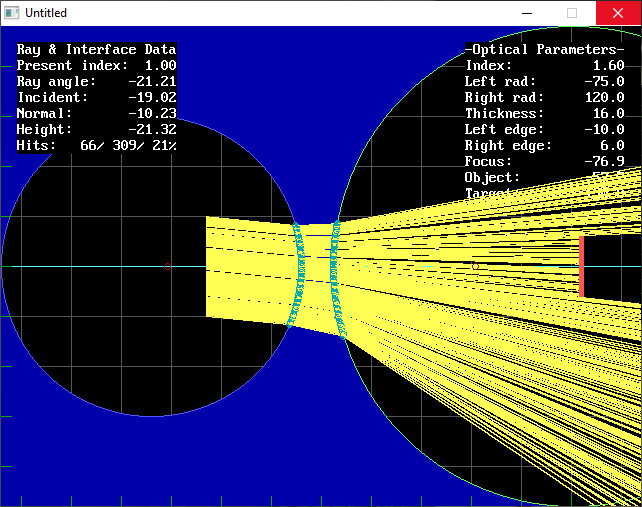
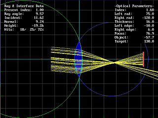

[Home](https://qb64.com) • [News](../../news.md) • [GitHub](https://github.com/QB64Official/qb64) • [Wiki](https://github.com/QB64Official/qb64/wiki) • [Samples](../../samples.md) • [InForm](../../inform.md) • [GX](../../gx.md) • [QBjs](../../qbjs.md) • [Community](../../community.md) • [More...](../../more.md)

## SAMPLE: LENS SIMULATOR



### Author

[🐝 STxAxTIC](../stxaxtic.md) 

### Description

```text
This program simulates light rays passing through a lens with a given index of refraction and concavity. The bent rays emerge to collide with a target (of fixed shape) or pass it by.
```

### QBjs

> Please note that QBjs is still in early development and support for these examples is extremely experimental (meaning will most likely not work). With that out of the way, give it a try!

* [LOAD "lens-simulator.bas"](https://qbjs.org/index.html?src=https://qb64.com/samples/lens-simulator/src/lens-simulator.bas)
* [RUN "lens-simulator.bas"](https://qbjs.org/index.html?mode=auto&src=https://qb64.com/samples/lens-simulator/src/lens-simulator.bas)
* [PLAY "lens-simulator.bas"](https://qbjs.org/index.html?mode=play&src=https://qb64.com/samples/lens-simulator/src/lens-simulator.bas)

### File(s)

* [lens-simulator.bas](src/lens-simulator.bas)

### Additional Image(s)



🔗 [2d](../2d.md), [ray tracer](../ray-tracer.md)
