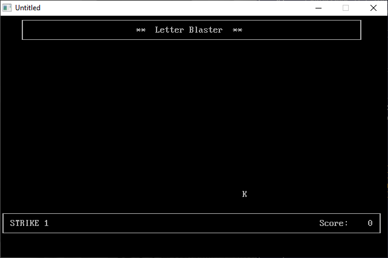

[Home](https://qb64.com) • [News](../../news.md) • [GitHub](https://github.com/QB64Official/qb64) • [Wiki](https://github.com/QB64Official/qb64/wiki) • [Samples](../../samples.md) • [InForm](../../inform.md) • [GX](../../gx.md) • [QBjs](../../qbjs.md) • [Community](../../community.md) • [More...](../../more.md)

## SAMPLE: LETTER BLAST



### Author

[🐝 A&A De Pasquale](../a&a-de-pasquale.md) 

### Description

```text
'   LETBLAST.BAS - Shoot the falling letters!
'      by Antonio & Alfonso De Pasquale
'
'   Copyright (C) 1993 DOS Resource Guide
'   Published in Issue #9, May 1993, page 50
'
' --------------------------------------------------------------
' Last modified by Robert Smith on 22 Jun 2006
' --Increased difficulty by penalizing player with
'   a strike if the player strikes the wrong key.
' --Added two new difficulties; training and really slow
'   because I suck at typing.
' Version number# 1.1
' --------------------------------------------------------------

==============================================================================

--------------
 LETBLAST.BAS
--------------
SYSTEM REQUIREMENTS:
The version of QBasic that comes with DOS 5 or later.

WHAT LETBLAST.BAS DOES:
This simple game helps you improve your typing skills by blasting randomly 
generated letters that cascade down the screen. As you increase the difficulty 
level from slow to intermediate to fast, the letters fall more quickly, making 
the game more challenging.

USING LETBLAST.BAS:
To load the program, type QBASIC LETBLAST.BAS (using path names if necessary) 
at the DOS prompt. Then run the program by selecting the Start option in 
QBasic's Run menu, or press Shift-F5. The screen clears, a greeting appears, 
and the program asks which speed you want to play at. Press S for slow, I for 
intermediate, and F for fast. When you're ready to begin the game, press 
Enter. Pressing Q and Enter ends the game.

When the game begins, letters start to fall from the top of the screen. Press 
the corresponding key on your keyboard to blast the letter. If you type the 
correct letter, the computer beeps and awards a point to you. If you miss a 
letter, the computer buzzes and gives you a strike. The game ends when you get 
three strikes or 50 letters.

At the end of the game, you receive your final score and an assessment of your 
performance. Press Enter to return to the main menu and play again.

For further details on LETBLAST.BAS, see "Letter Blaster" (DRG #9, May 1993, 
page 50).
```

### QBjs

> Please note that QBjs is still in early development and support for these examples is extremely experimental (meaning will most likely not work). With that out of the way, give it a try!

* [LOAD "letblast.bas"](https://qbjs.org/index.html?src=https://qb64.com/samples/letter-blast/src/letblast.bas)
* [RUN "letblast.bas"](https://qbjs.org/index.html?mode=auto&src=https://qb64.com/samples/letter-blast/src/letblast.bas)
* [PLAY "letblast.bas"](https://qbjs.org/index.html?mode=play&src=https://qb64.com/samples/letter-blast/src/letblast.bas)

### File(s)

* [letblast.bas](src/letblast.bas)

🔗 [game](../game.md), [letter](../letter.md), [dos world](../dos-world.md)
