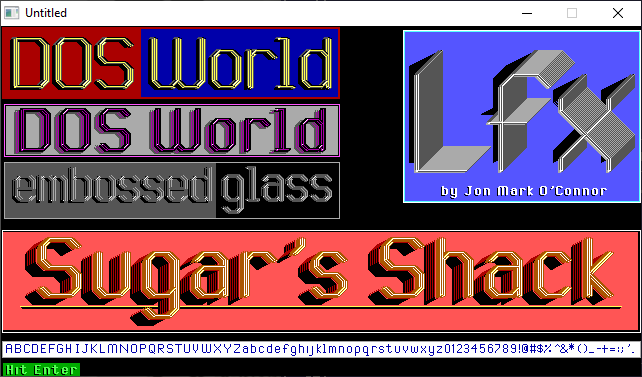

[Home](https://qb64.com) • [News](../../news.md) • [GitHub](https://github.com/QB64Official/qb64) • [Wiki](https://github.com/QB64Official/qb64/wiki) • [Samples](../../samples.md) • [InForm](../../inform.md) • [GX](../../gx.md) • [QBjs](../../qbjs.md) • [Community](../../community.md) • [More...](../../more.md)

## SAMPLE: LFX



### Author

[🐝 Jon Mark O'Connor](../jon-mark-o'connor.md) 

### Description

```text
''''''''''''''''''''''''''''''
'LFX by Jon Mark O'Connor    '
'                            '
''''''''''''''''''''''''''''''
'Copyright (C) 1995 DOS World
'Published in Issue #20, March 1995

***************************************************************************** 
 
 LFX.BAS 
   by Jon Mark O'Connor 
 Copyright (C) 1995 DOS World 
 Published in Issue #20, March 1995, page 59 
 
LFX.BAS is a lettering-effects generator that lets you vary the size of  
letters, from small to gigantic; produce shadowing; and parlay QBasic's 16  
colors into hundreds of different hues. The program's simplicity of design  
makes it easy to create thousands of lettering effects by changing just a few  
program values. If you like to dabble in QBasic, you can put LFX.BAS to work  
in your own QBasic programs in a matter of minutes. 
 
Because LFX.BAS was designed with modification in mind, you can produce  
professional-looking screens quickly, by typing in the text you want to  
display, indicating where to place that text on screen, choosing type size  
and foreground and background colors, and deciding how much shadowing to add. 
 
To run the program from the DOS command line, change to the directory  
containing LFX.BAS, then type: 
 
QBASIC /RUN LFX 
 
 
When you run the program, the word DOS will appear in a red box in the top- 
left corner of the screen. To the right of the red box is a blue box  
containing the word World. The text appears in gold and has shadow, depth,  
and a hint of shine in the corners of the letters. Where does the gold come  
from? It's not one of the colors for screen 9. (See the accompanying table,  
"Color Attributes," below.) Actually, you're seeing an effect achieved by  
layering. 
 
look at the section of LFX.BAS labeled EFFECT1 to discover how this hue is  
produced. The first two lines of this section use line commands to draw  
background boxes; they follow the standard syntax for filled boxes: 
 
LINE (X1, X2)-(Y1, Y2), C, BF 
 
where X1 is the distance (in pixels) of the box from the left edge of the  
screen, X2 is the distance from the top of the screen, Y1 is the distance  
from the right edge of the screen, Y2 is the distance from the bottom of the  
screen, C is a color value from zero to 15, and BF indicates that the box is  
filled. (If you use B instead of BF, you create the outline of a box.) In  
EFFECT1, the first line command creates a long red rectangle, and the second  
one superimposes a smaller, blue rectangle on the red one, leaving a red  
border two pixels wide on three sides. 
 
The next six lines of the program assign variables: 
 
WORD$ is the word or string you want to embellish. 
 
SPACING$ is the amount of space you want to place between words. Used in  
small sizes, the letterset designed for LFX.BAS is spaced properly, but when  
you use large letters, you must decrease the space between the letters. 
 
Ln tells the program to move left by n spaces; Rn tells the program to move  
right by n spaces. To maintain the original spacing, use L0 and R0. 
 
SIZE$ is the size of the letters. The value you specify must be a multiple of  
4; you may increase the value to roughly half the size of your screen's  
horizontal resolution. (In screen 9, the display is 640 pixels wide and 350  
pixels high.) Multiples other than 4 skew the letters. Because the subroutine  
LAYER1 employs extensive shadowing, using a size value smaller than 12 will  
probably produce unattractive results. For smaller letter sizes, use the  
program's NORMAL0 and NORMAL1 subroutines. 
 
DOT$ handles special circumstances that arise with the letters i and j. When  
you combine a small size value and shadowing, the dots over these letters  
disappear. Because the text displayed in EFFECT1 doesn't include either of  
these letters, DOT$ is set to N (for no dot). Later on, if you want to use  
EFFECT1 to display some text that includes an i or a j, change N to Y. 
 
BGC is the color of the background on which WORD$ is placed. Without this  
line, the listing's PSET commands produce unwanted colored blobs at the  
beginning of words. 
 
At this point, the program has the information it needs to change DOS World  
into a long drawing sequence. 
 
When the CALL TRANSLATE line executes, control jumps to the TRANSLATION  
subroutine, and conversion takes place. When control returns to the main  
program, the next line of EFFECT1 establishes the colors used to create the  
gold lettering and shadowing: yellow, white (gray), black, and light black  
(dark gray). 
 
Blending colors produces interesting hues. For example, if you place a light- 
red line next to a light-magenta line, you'll see pink on screen. If you  
change C1$ to "C15", WORD$ is displayed in silver instead of gold. As you  
experiment, you'll find that some colors blend well and others don't. 
 
Just for Effect 
--------------- 
The message DOS World is in a DRAW command, you've chosen the colors, and now  
it's time to display the message on screen--at varying locations and in  
varying colors, to give the illusion of depth. 
 
EFFECT1 works its magic by including four calls to the drawing subroutine  
LAYER1. Each time through, LAYER1 executes 12 PSET commands, each of which  
begins drawing at a different screen location. 
 
Keep in mind that the coordinates for the pixel in the upper-left corner are  
(0,0). So, when the starting positions for PFT and PFL are  
52 and 13, respectively, they're 53 pixels from the top and 14 pixels from  
the left. 
 
The first four commands in LAYER1 use C3$, black, to produce four renditions  
of the text in black. These renditions overlap, producing a shadowing effect.  
The use of gray in the fifth line adds more depth to the shadow. 
 
This same multilayer approach enhances the appearance of the gold lettering:  
three renditions of the text--two in yellow and one in white--overlap to give  
the words both height and depth. 
 
But maybe you don't care for gold, or you'd like a little less shadow. No  
problem. Just set different background colors, combine various foreground  
colors, experiment with the values of PFL and PFT, use more or fewer calls to  
LAYER1, or include more or fewer PSET commands. 
 
Remember, though: If you add too many shadows, the letters of your text will  
overlap, unless you increase the value of SPACING$. 
 
Try adding REM statements before all but one of the call LAYER1 or PSET  
lines, to get a sense of how that line affects the final appearance of the  
text. Repeat the procedure with other lines. 
 
Sometimes, making a slight change in PFT or PFL produces unexpectedly good  
results, which you can then capitalize on. 
 
Shadowing is also very important, as the rendition of Sugar's Shack (EFFECT4)  
demonstrates. Often, words that look plain are greatly improved by the  
addition of a series of shadows placed one or two pixels to the left or right  
of the main word. Be sure, however, to place the commands that draw shadows  
before the ones that draw the text so that the shadows remain in the  
background. 
 
If you're not sure whether a particular color is adding anything to the  
overall effect, change the color to something else. It isn't always apparent,  
for example, whether COLOR 8 is enhancing the appearance of a shadow. To find  
out, change the color value to 14. If you see yellow lines, you know that the  
original color is having an impact, and you may then change the color setting  
back to 8. 
 
Before you jump into creating full-screen displays, such as menus, consider  
the speed of your computer. On a 25MHz 386 or a slower system, displaying a  
full screen of special effects might take a few seconds. If neither you nor  
your clients or friends mind a delay of that length, then by all means go  
ahead with the project. If you don't want the user to see the effect being  
drawn, add the command SCREEN 9, 9, 0, 1 at the beginning of the display  
process and SCREEN 9, 9, 1, 0 at the end. This flashes the display on the  
screen. 
 
If you're not partial to either of those display methods, try using a SCREEN  
12 command to produce your effects at a higher resolution. 
 
Choices, choices, choices--LFX.BAS gives you a lot of them. But isn't that  
one of the great things about programming? You control the final effects. 
 
COLOR ATTRIBUTES 
 
VALUE       COLOR                    VALUE       COLOR 
-----       -----                    -----       ----- 
  0         black                      8         light black (dark gray) 
  1         blue                       9         light blue 
  2         green                     10         light green 
  3         cyan                      11         light cyan 
  4         red                       12         light red (orange) 
  5         magenta                   13         light magenta 
  6         brown                     14         yellow 
  7         white (gray)              15         high-intensity white
```

### QBjs

> Please note that QBjs is still in early development and support for these examples is extremely experimental (meaning will most likely not work). With that out of the way, give it a try!

* [LOAD "lfx.bas"](https://qbjs.org/index.html?src=https://qb64.com/samples/lfx/src/lfx.bas)
* [RUN "lfx.bas"](https://qbjs.org/index.html?mode=auto&src=https://qb64.com/samples/lfx/src/lfx.bas)
* [PLAY "lfx.bas"](https://qbjs.org/index.html?mode=play&src=https://qb64.com/samples/lfx/src/lfx.bas)

### File(s)

* [lfx.bas](src/lfx.bas)

🔗 [graphics](../graphics.md), [dos world](../dos-world.md)
