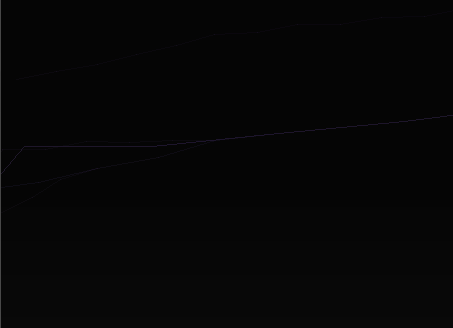

[Home](https://qb64.com) • [News](../../news.md) • [GitHub](../../github.md) • [Wiki](../../wiki.md) • [Samples](../../samples.md) • [Media](../../media.md) • [Community](../../community.md) • [Rolodex](../../rolodex.md) • [More...](../../more.md)

## SAMPLE: BEZIER



### Author

[🐝 Rho Sigma](../rho-sigma.md) 

### Description

```text
'+---------------+---------------------------------------------------+
'|_######_######_|_____.--._._________.-.____________________________|
'|_##__##_##___#_|_____|___)|________(___)_o_________________________|
'|_##__##__##____|_____|--'_|--._.-.__`-.__.__.-...--.--._.-.________|
'|_######___##___|_____|__\_|__|(___)(___)_|_(___||__|__|(___)_______|
'|_##______##____|_____'___`'__`-`-'__`-'-'_`-`-`|'__'__`-`-'`-______|
'|_##_____##___#_|____________________________._.'___________________|
'|_##_____######_|__Sources_&_Documents_placed_in_the_Public_Domain._|
'+---------------+---------------------------------------------------+
'|                                                                   |
'| === ScreenBlankers-Info.html ===                                  |
'|                                                                   |
'| == Some simple screen blankers I wrote using QB64.                |
'|                                                                   |
'+-------------------------------------------------------------------+
'| Done by RhoSigma, R.Heyder, provided AS IS, use at your own risk. |
'| Find me in the QB64 Forum or mail to support@rhosigma-cw.net for  |
'| any questions or suggestions. Thanx for your interest in my work. |
'+-------------------------------------------------------------------+
Screen Blankers
This is a small collection of some simple screen blanker modules. Most of them are written by myself, others were just graphic sample programs from other QB64 Forum members, which I've altered into a blanker module. Just read the header notes in each module for more information.

To install one of it (on a Windows system), simply rename the created .exe file with the new extension .scr, confirm the possible warning about changing the file extension with Yes. After that you can simply right click on the renamed file and choose Install.

Sorry, I've no idea how to do it on MacOS or Linux, any info about it from people who using these systems would be nice.
```

### Code

#### lightning.bas

```vb

'+---------------+---------------------------------------------------+
'| ###### ###### |     .--. .         .-.                            |
'| ##  ## ##   # |     |   )|        (   ) o                         |
'| ##  ##  ##    |     |--' |--. .-.  `-.  .  .-...--.--. .-.        |
'| ######   ##   |     |  \ |  |(   )(   ) | (   ||  |  |(   )       |
'| ##      ##    |     '   `'  `-`-'  `-'-' `-`-`|'  '  `-`-'`-      |
'| ##     ##   # |                            ._.'                   |
'| ##     ###### |  Sources & Documents placed in the Public Domain. |
'+---------------+---------------------------------------------------+
'|                                                                   |
'| === Lightning.bas ===                                             |
'|                                                                   |
'| == It's a flash thing.                                            |
'|                                                                   |
'+-------------------------------------------------------------------+
'| Done by RhoSigma, R.Heyder, provided AS IS, use at your own risk. |
'| Find me in the QB64 Forum or mail to support@rhosigma-cw.net for  |
'| any questions or suggestions. Thanx for your interest in my work. |
'+-------------------------------------------------------------------+

Dim Shared scrX%, scrY%
di& = _ScreenImage
scrX% = _Width(di&)
scrY% = _Height(di&)
_FreeImage di&
si& = _NewImage(scrX%, scrY%, 256)
Screen si&
_Delay 0.2: _ScreenMove _Middle
_Delay 0.2: _FullScreen

Const FORKINESS = 10 '1 to 20
Const FREQUENCY = 12 '1 to 15

Randomize Timer
_PaletteColor 0, _RGB32(0, 0, 0)
_PaletteColor 1, _RGB32(0, 0, 0)
_PaletteColor 2, _RGB32(0, 0, 0)
_PaletteColor 3, _RGB32(0, 0, 0)

_MouseHide
While InKey$ = "" And mx% = 0 And my% = 0
    Cls
    If RangeRand%(1, 100) > 50 Then
        DrawLightning RangeRand%(0, (scrX% / 2)), 0, 50, 0.785398163, 1
    Else
        DrawLightning RangeRand%((scrX% / 2), (scrX% - 1)), 0, 50, 2.35619449, 1
    End If

    i% = RangeRand%(1, 100)
    If i% < 25 Then
        j% = 8
        j% = j% + (i% And 7)
        While j% > 0
            _PaletteColor 1, _RGB32(170, 127, 255)
            _PaletteColor 2, _RGB32(102, 76, 153)
            _PaletteColor 3, _RGB32(34, 25, 51)
            _Display
            _PaletteColor 1, _RGB32(0, 0, 0)
            _PaletteColor 2, _RGB32(0, 0, 0)
            _PaletteColor 3, _RGB32(0, 0, 0)
            _Display
            j% = j% - 1
        Wend
    Else
        _PaletteColor 1, _RGB32(170, 127, 255)
        _PaletteColor 2, _RGB32(102, 76, 153)
        _PaletteColor 3, _RGB32(34, 25, 51)
        _Display
        _Delay 0.1
        _PaletteColor 1, _RGB32(0, 0, 0)
        _PaletteColor 2, _RGB32(0, 0, 0)
        _PaletteColor 3, _RGB32(0, 0, 0)
        _Display
    End If

    _Delay (10 * (20 - FREQUENCY - RangeRand%(0, 3))) * 0.02

    Do While _MouseInput
        mx% = mx% + _MouseMovementX
        my% = my% + _MouseMovementY
    Loop
Wend

_FullScreen _Off
_Delay 0.2: Screen 0
_Delay 0.2: _FreeImage si&
System

'======================================================================
Sub DrawLightning (X&, Y&, Segments&, Dir#, Fork&)
    Sign# = 0.392699081
    xSeg# = scrX% / (15.0 * Fork&)
    ySeg# = scrY% / (15.0 * Fork&)
    Do
        Angle& = RangeRand%(0, 100)
        DeltaAngle# = Sign# * Angle& / 100.0
        Dir# = Dir# + DeltaAngle#
        Sign# = Sign# * -1.0

        nX& = X& + (Cos(Dir#) * xSeg#)
        nY& = Y& + (Sin(Dir#) * ySeg#)
        DrawLine X&, Y&, nX&, nY&, Fork&
        X& = nX&
        Y& = nY&

        If ((Fork& < 3) And (RangeRand%(0, 50) < (FORKINESS / Fork&))) Then
            DrawLightning (X&), (Y&), 5 + RangeRand%(1, 10), Dir# - (2.0 * DeltaAngle#), Fork& + 1
        End If
        Segments& = Segments& - 1
    Loop While Segments& > 0 And Y& < scrY%
End Sub

'======================================================================
Sub DrawLine (x1%, y1%, x2%, y2%, col%)
    If x1% < 0 Then
        If x2% < 0 Then Exit Sub
        x1% = 0
    ElseIf x1% >= scrX% Then
        If x2% >= scrX% Then Exit Sub
        x1% = scrX% - 1
    End If
    If y1% < 0 Then
        If y2% < 0 Then Exit Sub
        y1% = 0
    ElseIf y1% >= scrY% Then
        If y2% >= scrY% Then Exit Sub
        y1% = scrY% - 1
    End If

    If x2% < 0 Then
        x2% = 0
    ElseIf x2% >= scrX% Then
        x2% = scrX% - 1
    End If
    If y2% < 0 Then
        y2% = 0
    ElseIf y2% >= scrY% Then
        y2% = scrY% - 1
    End If

    Line (x1%, y1%)-(x2%, y2%), col%
End Sub

'======================================================================
Function RangeRand% (low%, high%)
    RangeRand% = Int(Rnd(1) * (high% - low% + 1)) + low%
End Function

```

### File(s)

* [lightning.bas](src/lightning.bas)

🔗 [screenblanker](../screenblanker.md)
