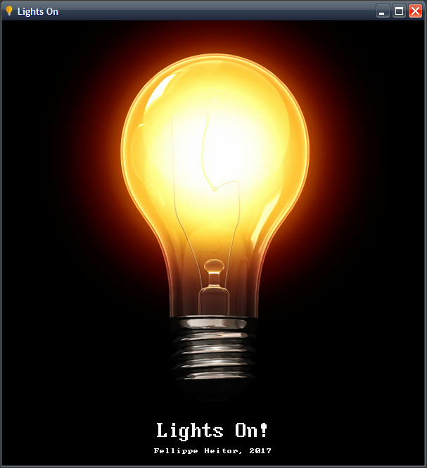
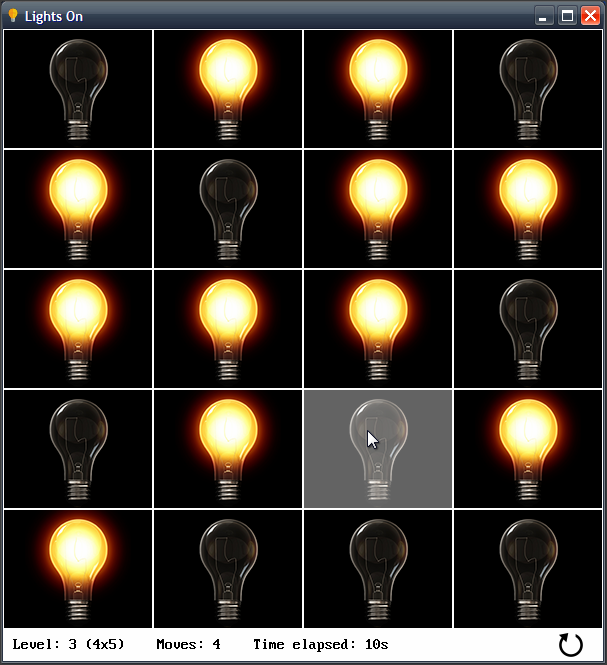
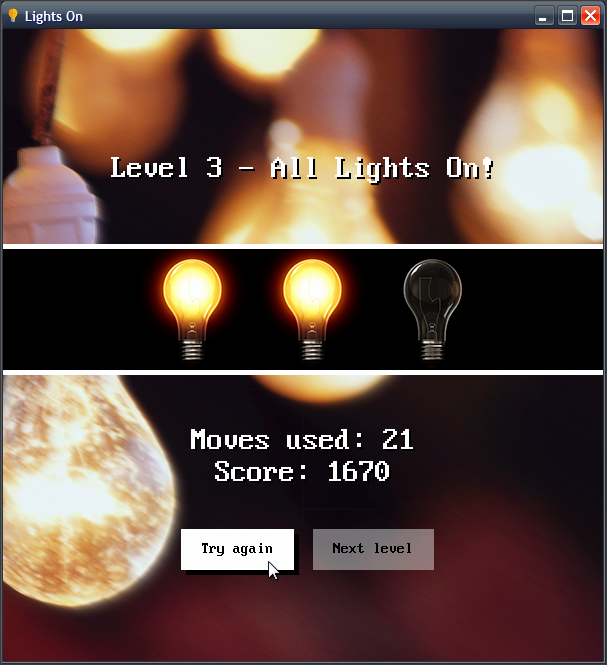

[Home](https://qb64.com) • [News](../../news.md) • [GitHub](https://github.com/QB64Official/qb64) • [Wiki](https://github.com/QB64Official/qb64/wiki) • [Samples](../../samples.md) • [InForm](../../inform.md) • [GX](../../gx.md) • [QBjs](../../qbjs.md) • [Community](../../community.md) • [More...](../../more.md)

## SAMPLE: LIGHTSON



### Author

[🐝 Fellippe Heitor](../fellippe-heitor.md) 

### Description

```text
'Lights On
'A game by Fellippe Heitor.
'
'Original concept by Avi Olti, Gyora Benedek, Zvi Herman, Revital Bloomberg, Avi Weiner and Michael Ganor
'https://en.wikipedia.org/wiki/Lights_Out_(game)
```

### QBjs

> Please note that QBjs is still in early development and support for these examples is extremely experimental (meaning will most likely not work). With that out of the way, give it a try!

* [LOAD "lightson.bas"](https://qbjs.org/index.html?src=https://qb64.com/samples/lightson/src/lightson.bas)
* [RUN "lightson.bas"](https://qbjs.org/index.html?mode=auto&src=https://qb64.com/samples/lightson/src/lightson.bas)
* [PLAY "lightson.bas"](https://qbjs.org/index.html?mode=play&src=https://qb64.com/samples/lightson/src/lightson.bas)

### File(s)

* [lightson.bas](src/lightson.bas)
* [lightson.zip](src/lightson.zip)

### Additional Image(s)




🔗 [game](../game.md), [lights](../lights.md)


<sub>Reference: [github.com](https://github.com/FellippeHeitor/LightsOn) </sub>
