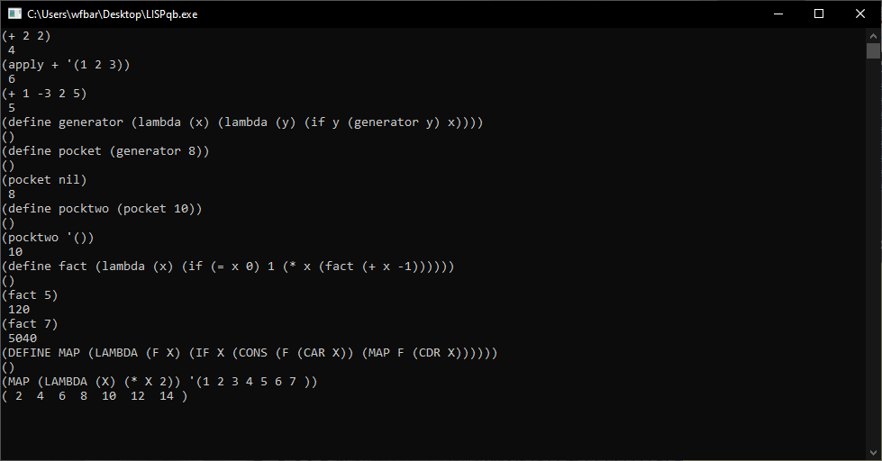

[Home](https://qb64.com) • [News](../../news.md) • [GitHub](https://github.com/QB64Official/qb64) • [Wiki](https://github.com/QB64Official/qb64/wiki) • [Samples](../../samples.md) • [InForm](../../inform.md) • [GX](../../gx.md) • [QBjs](../../qbjs.md) • [Community](../../community.md) • [More...](../../more.md)

## SAMPLE: LISP INTERPRETER



### Author

[🐝 qbguy](../qbguy.md) 

### Description

```text
Scheme is a functional programming language that uses a minimalist implementation of the LISP language.

Any sufficiently complicated C or Fortran program contains an ad hoc, informally-specified, bug-ridden, slow implementation of half of Common Lisp. - Greenspun's tenth rule of programming
```

### File(s)

* [lispqb.bas](src/lispqb.bas)
* [lisptest.bas](src/lisptest.bas)

🔗 [interpreter](../interpreter.md), [lisp](../lisp.md)
