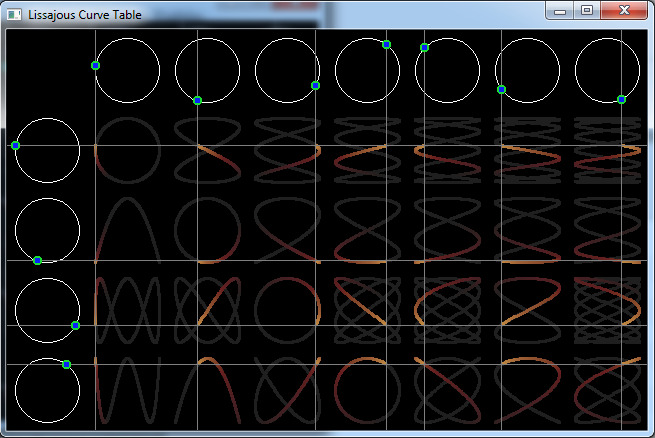

[Home](https://qb64.com) • [News](../../news.md) • [GitHub](https://github.com/QB64Official/qb64) • [Wiki](https://github.com/QB64Official/qb64/wiki) • [Samples](../../samples.md) • [InForm](../../inform.md) • [GX](../../gx.md) • [QBjs](../../qbjs.md) • [Community](../../community.md) • [More...](../../more.md)

## SAMPLE: LISSAJOUS CURVE TABLE



### Author

[🐝 Fellippe Heitor](../fellippe-heitor.md) 

### Description

```text
Graphical Lissajou's Figures.  For added eye-candy-ness, I've changed the plot line to paint using HSB colors so that ink color will vary according to the current rotational angle.
```

### QBjs

> Please note that QBjs is still in early development and support for these examples is extremely experimental (meaning will most likely not work). With that out of the way, give it a try!

* [LOAD "lissajous-curve-table.bas"](https://qbjs.org/index.html?src=https://qb64.com/samples/lissajous-curve-table/src/lissajous-curve-table.bas)
* [RUN "lissajous-curve-table.bas"](https://qbjs.org/index.html?mode=auto&src=https://qb64.com/samples/lissajous-curve-table/src/lissajous-curve-table.bas)
* [PLAY "lissajous-curve-table.bas"](https://qbjs.org/index.html?mode=play&src=https://qb64.com/samples/lissajous-curve-table/src/lissajous-curve-table.bas)

### File(s)

* [lissajous-curve-table.bas](src/lissajous-curve-table.bas)

🔗 [graphics](../graphics.md), [trigonometry](../trigonometry.md)


<sub>Reference: [qb64forum](https://qb64forum.alephc.xyz/index.php?topic=2322.0) </sub>
