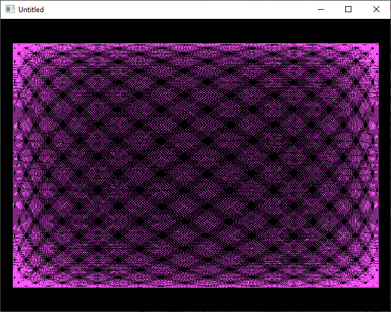

[Home](https://qb64.com) • [News](../../news.md) • [GitHub](../../github.md) • [Wiki](../../wiki.md) • [Samples](../../samples.md) • [Media](../../media.md) • [Community](../../community.md) • [Rolodex](../../rolodex.md) • [More...](../../more.md)

## SAMPLE: LISSAJOUS SCREENSAVER



### Author

[🐝 Antoni Gual](../antoni-gual.md) 

### Description

```text
'Lissajous by Antoni Gual
'for Rel's 9 LINER contest at QBASICNEWS.COM  1/2003
'------------------------------------------------------------------------
```

### Code

#### lissaj.bas

```vb

'Lissajous by Antoni Gual
'for Rel's 9 LINER contest at QBASICNEWS.COM  1/2003
'------------------------------------------------------------------------
$NoPrefix
DefLng A-Z
Option Explicit
Option ExplicitArray

$Resize:Smooth

Screen 12
FullScreen SquarePixels , Smooth

Dim As Long i, j, n
Dim As Single k, l
Do
    Cls
    i = (i + 1) And &HFFFFF
    k = 6.3 * Rnd
    l = 6.3 * Rnd
    n = (n + 1) Mod 15
    For j = 0 To 100000
        PSet (320 + 300 * Sin(.01 * Sin(k) + j), 240 + 200 * Sin(.01 * Sin(l) * j)), n + 1
    Next
    Limit 60
Loop While Len(InKey$) = 0

System 0

```

### File(s)

* [lissaj.bas](src/lissaj.bas)

🔗 [screensaver](../screensaver.md), [9 lines](../9-lines.md)
