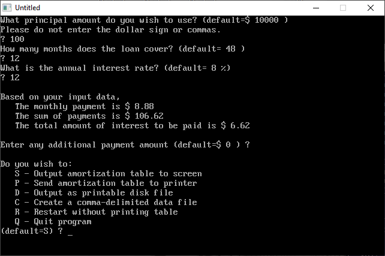

[Home](https://qb64.com) • [News](../../news.md) • [GitHub](https://github.com/QB64Official/qb64) • [Wiki](https://github.com/QB64Official/qb64/wiki) • [Samples](../../samples.md) • [InForm](../../inform.md) • [GX](../../gx.md) • [QBjs](../../qbjs.md) • [Community](../../community.md) • [More...](../../more.md)

## SAMPLE: LOAN AMORTIZATION



### Author

[🐝 Alan Zeichick](../alan-zeichick.md) 

### Description

```text
' Loan amortization program
' Alan Zeichick, March 16, 1993
' Copyright (c) 1993 DOS Resource Guide
' Published in Issue #11, September 1993, page 49
'
' This program produces a loan amortization table, given
' the amount of a loan, number of payments, annual interest
' rate, and extra money (if any) to be paid each month.

******************************************************************************

-----------
 AMORT.BAS
-----------
SYSTEM REQUIREMENTS:
The version of QBasic that comes with DOS 5 or later, or Microsoft Quick Basic 
4.x, and (optionally) a printer.

WHAT AMORT.BAS DOES
This program lets you calculate and print a table of principal and interest 
payments for a loan.  Use it to determine the amount of each payment and the 
amount of interest you'll pay over the term of the loan.

USING AMORT.BAS
To load the program, type QBASIC AMORT.BAS (using pathnames if necessary) 
at the DOS prompt. Then run the program by selecting the Start option in 
QBasic's Run menu, or press Shift-F5. The screen clears, and the program 
requests several items of information.  These include the principal amount, 
the term of the loan in months, and the interest rate.  At this point, 
AMORT.BAS calculates and displays the monthly payment amount, the sum of all 
payments, and the total interest paid.  The program now lets you add an extra 
amount to be applied toward the pricipal each month, if you wish.  Doing so 
can dramatically decrease the term of the loan and the total interest paid.

Next, the program offers a set of options for displaying, saving, and printing 
the amortization table.  Option S displays the table on the screen, while P 
sends it to your printer.  Pressing D saves the table to a disk file suitable 
for printing, while C creates a comma-delimited data file that can be imported 
into a spreadsheet or other program.  Option R allows starting a new 
calculation without printing or displaying the amortization table, and Q quits 
the program.

For further details on AMORT.BAS, see "An Interest in QBasic" (DRG #11, 
September 1993, page 49).
```

### QBjs

> Please note that QBjs is still in early development and support for these examples is extremely experimental (meaning will most likely not work). With that out of the way, give it a try!

* [LOAD "amort.bas"](https://qbjs.org/index.html?src=https://qb64.com/samples/loan-amortization/src/amort.bas)
* [RUN "amort.bas"](https://qbjs.org/index.html?mode=auto&src=https://qb64.com/samples/loan-amortization/src/amort.bas)
* [PLAY "amort.bas"](https://qbjs.org/index.html?mode=play&src=https://qb64.com/samples/loan-amortization/src/amort.bas)

### File(s)

* [amort.bas](src/amort.bas)

🔗 [finance](../finance.md), [dos world](../dos-world.md)
