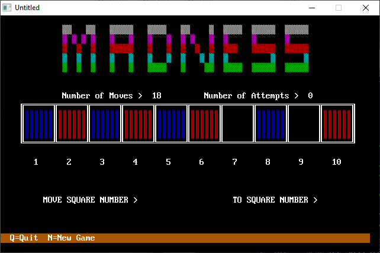

[Home](https://qb64.com) • [News](../../news.md) • [GitHub](https://github.com/QB64Official/qb64) • [Wiki](https://github.com/QB64Official/qb64/wiki) • [Samples](../../samples.md) • [InForm](../../inform.md) • [GX](../../gx.md) • [QBjs](../../qbjs.md) • [Community](../../community.md) • [More...](../../more.md)

## SAMPLE: MADNESS



### Author

[🐝 Dennis Mull](../dennis-mull.md) 

### Description

```text
***************************************************************************** 
 
 MADNESS.BAS 
   by Dennis Mull and Tina Sweet 
 Copyright (C) 1994 DOS World 
 Published in Issue #22, July 199, page 53 
 
MADNESS.BAS will test your genius for solving puzzles.  It's easy to play,  
but hard to win. 
 
Play centers on a board consisting of a row of ten squares. Each of the four  
squares at the left end of the board contains a red playing piece; each of  
the four squares on the right end contains a blue piece. To win, you must  
move the red pieces to the right end of the board and the blue pieces to the  
left end. But you can move a piece only by jumping over another piece or by  
advancing it one or two blank spaces at time. You can't move backward. Think  
you can figure it out? Have a try! 
 
To run the program from the DOS command line, change to the directory  
containing MADNESS.BAS, then type: 
 
QBASIC /RUN MADNESS 
 
 
Watch carefully; you might learn something, because the program begins by  
providing a demonstration of one way to win the game. 
 
After the demo ends, MADNESS.BAS resets the game board. Messages above the  
playing grid tell you the number of moves and the number of attempts in the  
current round of play. Below the grid are numbers identifying each square and  
prompts asking you to type the number of the piece you want to move and its  
new location. A highlighted bar at the bottom of the screen tells you to  
press the Q key to quit or the N key to start the game over. 
 
Now comes the challenge: figuring out a sequence of jumps and advances that  
swap the positions of the red and blue pieces. Don't even think about trying  
to move a playing piece backward. If you do, the program sounds a buzzer,  
displays a "Sorry, you may not jump backward" message, and adds two extra  
moves to your score. 
 
The good news is that if you meet success in four or fewer games, the program  
awards you genius status. If not, no harm done, and play continues until you  
decide to quit. 
 
Points of Interest 
------------------ 
Pay attention to some special features of this program: the subroutines  
KEYKILL, MAKESOUND, and WARNING, plus the lines in the main program  
associated with them. You may find these routines useful in your own  
programs. 
 
KEYKILL keeps unwanted keystrokes from being executed while the program is  
handling other tasks. To achieve this, it clears the keyboard buffer before  
another input statement is executed. 
 
MAKESOUND provides control over the game's sound effects. It's a versatile  
routine. because you can add new sounds to it merely by changing the value of  
the variable WHICH% and adding a CASE and a SOUND statement to the  
subroutine. When a particular case condition is met, the program plays the  
sound immediately after that case command. To play the sound, use a line such  
as this one: 
 
IF AA% = 0 OR BB% = 0 THEN MAKESOUND 2: GOTO REDO 
 
If the value of AA% or BB% is zero, the program executes the MAKESOUND  
subroutine with the value of WHICH% set to 2. As a result, the CASE 2 sound--  
sound 50, 5 --plays. 
 
The structure of WARNING is comparable to that of MAKESOUND. This time,  
however, instead of triggering different sounds, various values sent to  
WARNING trigger different messages. 
 
As with MAKESOUND, you may add elements by appending CASE statements and  
their corresponding messages. Here, for instance, the value sent to WARNING  
is 4: 
 
IF A$ <> "" THEN 
  IF BOX$(AA%) = "BLANK" THEN WARNING 4: A$ = "" 
END IF 
 
When the second line executes, the message corresponding to CASE 4 is  
displayed: "Sorry, you may not move an empty square."
```

### QBjs

> Please note that QBjs is still in early development and support for these examples is extremely experimental (meaning will most likely not work). With that out of the way, give it a try!

* [LOAD "madness.bas"](https://qbjs.org/index.html?src=https://qb64.com/samples/madness/src/madness.bas)
* [RUN "madness.bas"](https://qbjs.org/index.html?mode=auto&src=https://qb64.com/samples/madness/src/madness.bas)
* [PLAY "madness.bas"](https://qbjs.org/index.html?mode=play&src=https://qb64.com/samples/madness/src/madness.bas)

### File(s)

* [madness.bas](src/madness.bas)

🔗 [game](../game.md), [dos world](../dos-world.md)
