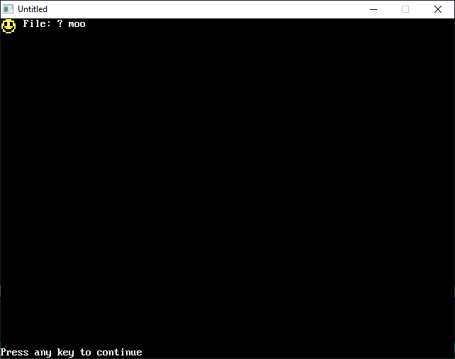

[Home](https://qb64.com) • [News](../../news.md) • [GitHub](https://github.com/QB64Official/qb64) • [Wiki](https://github.com/QB64Official/qb64/wiki) • [Samples](../../samples.md) • [InForm](../../inform.md) • [GX](../../gx.md) • [QBjs](../../qbjs.md) • [Community](../../community.md) • [More...](../../more.md)

## SAMPLE: MAKEBIG



### Description

```text
'MakeBig.bas:
'This program reads data statements and uses pset to draw the
'pixel color they represent.This is familiar to a few people
'but I altered it to make the image twice as large as it is normaly
```

### QBjs

> Please note that QBjs is still in early development and support for these examples is extremely experimental (meaning will most likely not work). With that out of the way, give it a try!

* [LOAD "makebig.bas"](https://qbjs.org/index.html?src=https://qb64.com/samples/makebig/src/makebig.bas)
* [RUN "makebig.bas"](https://qbjs.org/index.html?mode=auto&src=https://qb64.com/samples/makebig/src/makebig.bas)
* [PLAY "makebig.bas"](https://qbjs.org/index.html?mode=play&src=https://qb64.com/samples/makebig/src/makebig.bas)

### File(s)

* [makebig.bas](src/makebig.bas)

🔗 [graphics](../graphics.md), [legacy](../legacy.md), [qbjs](../qbjs.md)
