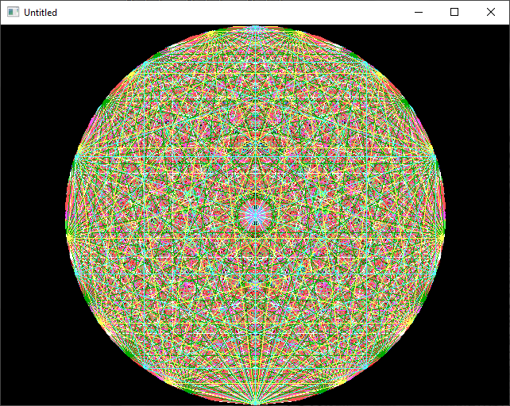

[Home](https://qb64.com) • [News](../../news.md) • [GitHub](../../github.md) • [Wiki](../../wiki.md) • [Samples](../../samples.md) • [Media](../../media.md) • [Community](../../community.md) • [Rolodex](../../rolodex.md) • [More...](../../more.md)

## SAMPLE: MANDALA 9 LINE



### Author

[🐝 Antoni Gual](../antoni-gual.md) 

### Description

```text
'Mandala by Antoni gual
'for Rel's 9 LINER contest at QBASICNEWS.COM  1/2003
'------------------------------------------------------------------------
```

### Code

#### mandala.bas

```vb

'Mandala by Antoni gual
'for Rel's 9 LINER contest at QBASICNEWS.COM  1/2003
'------------------------------------------------------------------------

$NoPrefix
DefLng A-Z
Option Explicit
Option ExplicitArray

$Resize:Smooth

Screen 12
FullScreen SquarePixels , Smooth

Dim As Long v, d1, d2

Do
    v = Rnd * 20 + 10
    ReDim VX%(v), VY%(v)
    For d1 = -1 To v
        For d2 = d1 + 1 To v
            If d1 = -1 Then VX%(d2) = 320 + (Sin(6.283185 * (d2 / v)) * 239) Else Line (VX%(d1), VY%(d1))-(VX%(d2), VY%(d2)), (v Mod 16) + 1
            If d1 = -1 Then VY%(d2) = 240 + (Cos(6.283185 * (d2 / v)) * 239)
        Next
    Next
    Limit 60
Loop While Len(InKey$) = 0

System 0

```

### File(s)

* [mandala.bas](src/mandala.bas)

🔗 [screensaver](../screensaver.md), [9 lines](../9-lines.md)
