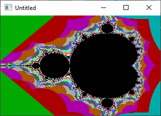

[Home](https://qb64.com) • [News](../../news.md) • [GitHub](https://github.com/QB64Official/qb64) • [Wiki](https://github.com/QB64Official/qb64/wiki) • [Samples](../../samples.md) • [InForm](../../inform.md) • [GX](../../gx.md) • [QBjs](../../qbjs.md) • [Community](../../community.md) • [More...](../../more.md)

## SAMPLE: MANDELBROT SET 2003



### Author

[🐝 Antoni Gual](../antoni-gual.md) 

### Description

```text
'MANDELBROT by Antoni Gual 2003
'for Rel's 9 LINER contest at QBASICNEWS.COM  1/2003
'------------------------------------------------------------------------
```

### File(s)

* [mandelb.bas](src/mandelb.bas)
* [mandelb_orig.bas](src/mandelb_orig.bas)

🔗 [fractal](../fractal.md), [mandelbrot](../mandelbrot.md), [9 lines](../9-lines.md)
