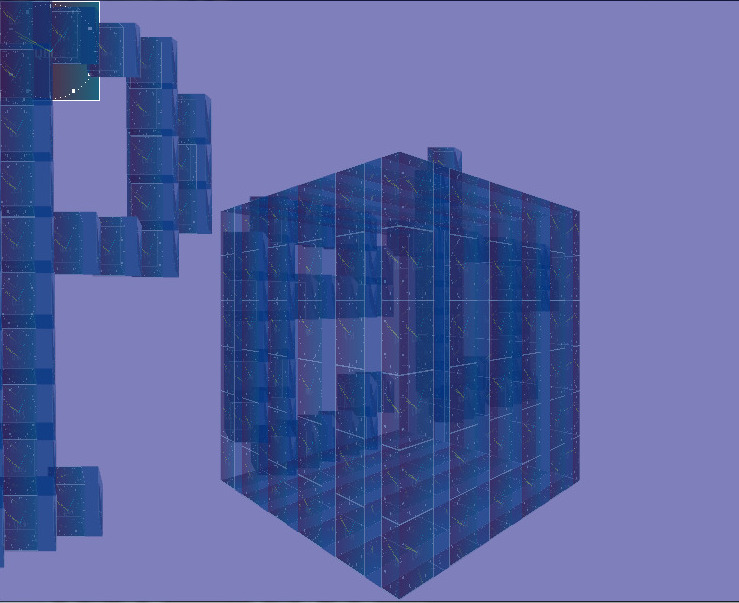

[Home](https://qb64.com) • [News](../../news.md) • [GitHub](https://github.com/QB64Official/qb64) • [Wiki](https://github.com/QB64Official/qb64/wiki) • [Samples](../../samples.md) • [InForm](../../inform.md) • [GX](../../gx.md) • [QBjs](../../qbjs.md) • [Community](../../community.md) • [More...](../../more.md)

## SAMPLE: MAPTRIANGLE IN 3D



### Author

[🐝 Petr](../petr.md) 

### Description

```text
A demo to show rotation in 3D using MAPTRIANGLE 3D, without direct OpenGL statements.

Librarian's Note: The sample given here is just one of a number of _MAPTRIANGLE(3D) examples which appear in Petr's post. That post is a good learning resource for anyone wanting to learn 3D graphics using _MAPTRIANGLE(3D). See https://qb64forum.alephc.xyz/index.php?topic=300.msg101478#msg101478
```

### QBjs

> Please note that QBjs is still in early development and support for these examples is extremely experimental (meaning will most likely not work). With that out of the way, give it a try!

* [LOAD "maptriangle3d.bas"](https://qbjs.org/index.html?src=https://qb64.com/samples/maptriangle-in-3d/src/maptriangle3d.bas)
* [RUN "maptriangle3d.bas"](https://qbjs.org/index.html?mode=auto&src=https://qb64.com/samples/maptriangle-in-3d/src/maptriangle3d.bas)
* [PLAY "maptriangle3d.bas"](https://qbjs.org/index.html?mode=play&src=https://qb64.com/samples/maptriangle-in-3d/src/maptriangle3d.bas)

### File(s)

* [maptriangle3d.bas](src/maptriangle3d.bas)

🔗 [3d](../3d.md), [maptriangle](../maptriangle.md)


<sub>Reference: [qb64forum](https://qb64forum.alephc.xyz/index.php?topic=2405.0) </sub>
