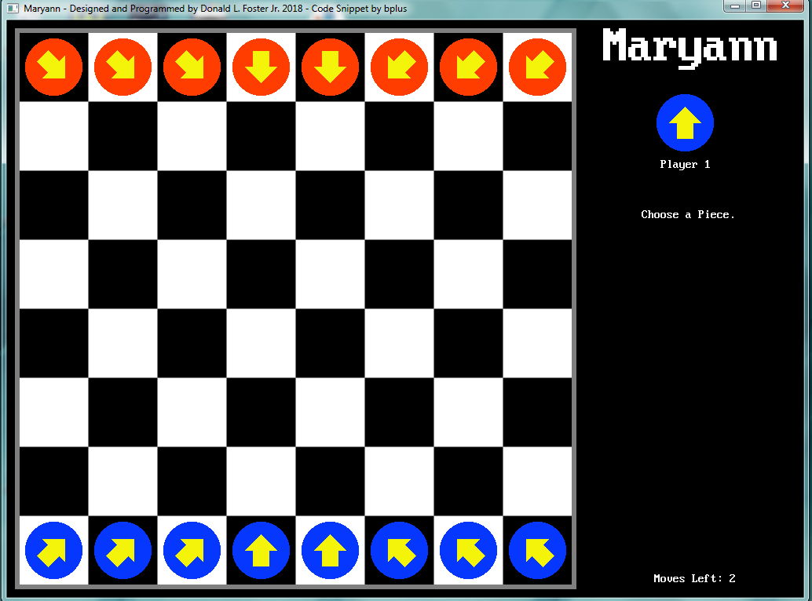

[Home](https://qb64.com) • [News](../../news.md) • [GitHub](https://github.com/QB64Official/qb64) • [Wiki](https://github.com/QB64Official/qb64/wiki) • [Samples](../../samples.md) • [InForm](../../inform.md) • [GX](../../gx.md) • [QBjs](../../qbjs.md) • [Community](../../community.md) • [More...](../../more.md)

## SAMPLE: MARYANN



### Author

[🐝 Donald Foster](../donald-foster.md) 

### Description

```text
Maryann is a board game I designed and named it after my wife. I put together a board game that combine rules, features and characteristics of different board games.

The game is played on an 8x8 checkered board with 8 round discs lined up on each back row with arrows on top. The arrows point to the location where it can move to next. Each players turn consists of 2 moves. Moves consists on either one of the following: rotate player's piece, move a piece 1 space up,down, right, left, or diagonal, jump own pieces  diagonal or capture opponent's piece up, down, left or right. A piece can be rotated on the same move, counts as 2 moves, Can move 1 piece twice or 2 pieces once. As pieces are removed from rows and columns the outer rows and columns are removed from the board. The winner is the player who captures their opponents first.
```

### QBjs

> Please note that QBjs is still in early development and support for these examples is extremely experimental (meaning will most likely not work). With that out of the way, give it a try!

* [LOAD "maryann.bas"](https://qbjs.org/index.html?src=https://qb64.com/samples/maryann/src/maryann.bas)
* [RUN "maryann.bas"](https://qbjs.org/index.html?mode=auto&src=https://qb64.com/samples/maryann/src/maryann.bas)
* [PLAY "maryann.bas"](https://qbjs.org/index.html?mode=play&src=https://qb64.com/samples/maryann/src/maryann.bas)

### File(s)

* [maryann.bas](src/maryann.bas)

🔗 [game](../game.md)


<sub>Reference: [qb64forum](https://qb64forum.alephc.xyz/index.php?topic=124.0) </sub>
