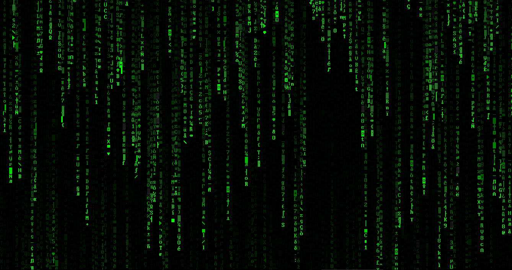

[Home](https://qb64.com) • [News](../../news.md) • [GitHub](../../github.md) • [Wiki](../../wiki.md) • [Samples](../../samples.md) • [Media](../../media.md) • [Community](../../community.md) • [Rolodex](../../rolodex.md) • [More...](../../more.md)

## SAMPLE: MATRIX EFFECT



### Author

[🐝 TylerDarko](../tylerdarko.md) 

### Description

```text
If you look close, it spells F-e-l-l-i-p-p-e.
```

### Code

#### darkomatrix.bas

```vb

SCREEN _NEWIMAGE(_DESKTOPWIDTH, _DESKTOPHEIGHT, 32)
'_FULLSCREEN
DIM m(1 TO INT(_WIDTH / _FONTWIDTH))

FOR i = 1 TO UBOUND(m)
    m(i) = -INT(RND * _HEIGHT)
NEXT

COLOR _RGB32(0, 255, 0)

DO
    _LIMIT 15
    LINE (0, 0)-(_WIDTH, _HEIGHT), _RGBA32(0, 0, 0, 20), BF

    FOR i = 1 TO UBOUND(m)
        m(i) = m(i) + _FONTHEIGHT
        IF m(i) > 0 THEN
            IF m(i) > _HEIGHT THEN m(i) = -INT(RND * _HEIGHT)
            _PRINTSTRING (i * _FONTWIDTH - _FONTWIDTH, m(i)), CHR$(_CEIL(RND * 254))
        END IF
    NEXT

    _DISPLAY
LOOP UNTIL _KEYHIT = 27
SYSTEM

```

### File(s)

* [darkomatrix.bas](src/darkomatrix.bas)

🔗 [ascii](../ascii.md), [matrix](../matrix.md)


<sub>Reference: [qb64.net Forum](https://qb64forum.alephc.xyz/index.php?topic=183.0) </sub>
