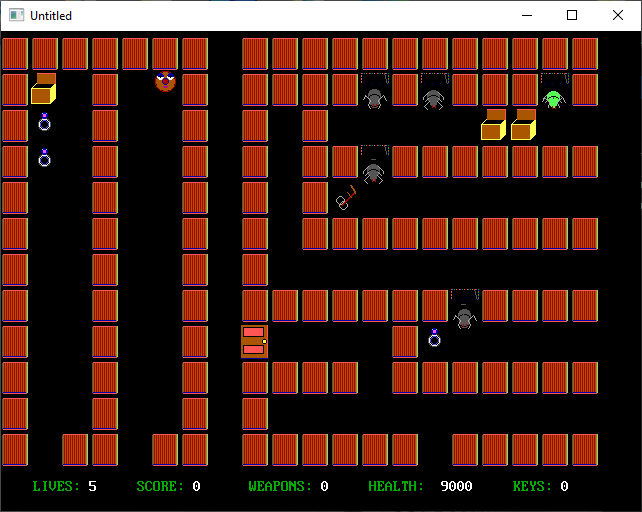

[Home](https://qb64.com) • [News](../../news.md) • [GitHub](https://github.com/QB64Official/qb64) • [Wiki](https://github.com/QB64Official/qb64/wiki) • [Samples](../../samples.md) • [InForm](../../inform.md) • [GX](../../gx.md) • [QBjs](../../qbjs.md) • [Community](../../community.md) • [More...](../../more.md)

## SAMPLE: MAZE OF MISERY



### Author

[🐝 Steve M.](../steve-m..md) 

### Description

```text
'Maze of Misery
'By Steve M. (c),May 5,01
'****************

'Please visit my web page at:  www.angelfire.com/bc2/cuebasic/qpage.html
'
'Disclaimer: This program may not be distributed, modified or copied without
'written permission from the author at yochatwitme@yahoo.com.
'Not liable for system or hardware damage. Tho' I can assure you that you
'won't experience any problems. Email me at yochatwitme@yahoo.com about
'any concerns or difficulties you may be having.
'Finally, you have my permission to post the program on your web page.
'Hope you enjoy the game.
'
'Thanks. SM :)
'Gbgames Chatname: QB4ever
```

### File(s)

* [mzupd2.bas](src/mzupd2.bas)
* [mzupd2_orig.bas](src/mzupd2_orig.bas)

🔗 [game](../game.md), [maze](../maze.md)
