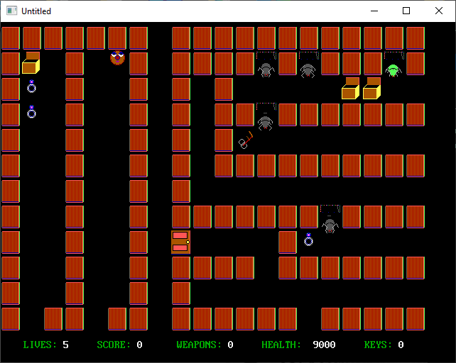

[Home](https://qb64.com) • [News](../../news.md) • [GitHub](https://github.com/QB64Official/qb64) • [Wiki](https://github.com/QB64Official/qb64/wiki) • [Samples](../../samples.md) • [Inform](../../inform.md) • [GX](../../gx.md) • [QBjs](../../qbjs.md) • [Community](../../community.md) • [More...](../../more.md)

## SAMPLE: MAZES OF MISERY



### Author

[🐝 Steve M.](../steve-m..md) 

### Description

```text
'Maze of Misery
'By Steve M. (c),May 5,01
'****************

'Please visit my web page at:  www.angelfire.com/bc2/cuebasic/qpage.html
'
'Disclaimer: This program may not be distributed, modified or copied without
'written permission from the author at yochatwitme@yahoo.com.
'Not liable for system or hardware damage. Tho' I can assure you that you
'won't experience any problems. Email me at yochatwitme@yahoo.com about
'any concerns or difficulties you may be having.
'Finally, you have my permission to post the program on your web page.
'Hope you enjoy the game.
'
'Thanks. SM :)
'Gbgames Chatname: QB4ever
```

### QBjs

> Please note that QBjs is still in early development and support for these examples is extremely experimental (meaning will most likely not work). With that out of the way, give it a try!

* [LOAD "mzupd2.bas"](https://v6p9d9t4.ssl.hwcdn.net/html/5963335/index.html?src=https://qb64.com/samples/mazes-of-misery/src/mzupd2.bas)
* [RUN "mzupd2.bas"](https://v6p9d9t4.ssl.hwcdn.net/html/5963335/index.html?mode=auto&src=https://qb64.com/samples/mazes-of-misery/src/mzupd2.bas)
* [PLAY "mzupd2.bas"](https://v6p9d9t4.ssl.hwcdn.net/html/5963335/index.html?mode=play&src=https://qb64.com/samples/mazes-of-misery/src/mzupd2.bas)

### File(s)

* [mzupd2.bas](src/mzupd2.bas)

🔗 [game](../game.md), [maze](../maze.md)
