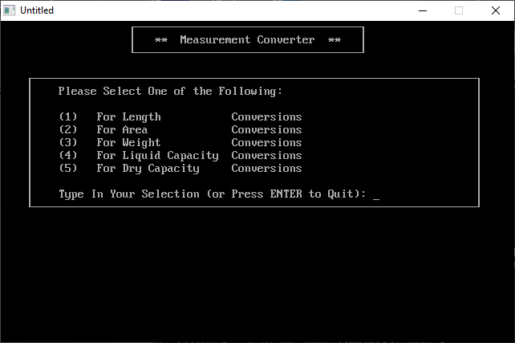

[Home](https://qb64.com) • [News](../../news.md) • [GitHub](https://github.com/QB64Official/qb64) • [Wiki](https://github.com/QB64Official/qb64/wiki) • [Samples](../../samples.md) • [InForm](../../inform.md) • [GX](../../gx.md) • [QBjs](../../qbjs.md) • [Community](../../community.md) • [More...](../../more.md)

## SAMPLE: MEASURE



### Author

[🐝 A&A De Pasquale](../a&a-de-pasquale.md) 

### Description

```text
'  MEASURE.BAS - A program for performing measurement conversions
'     by Antonio & Alfonso De Pasquale
'
'  Copyright (C) 1993 DOS Resource Guide
'                     80 Elm Street
'                     Peterborough NH  03458
'  Published in Issue #13, January 1994, page 50
'

==============================================================================

-------------
 MEASURE.BAS
-------------
SYSTEM REQUIREMENTS:
The version of QBasic that comes with DOS 5 or later.

WHAT MEASURE.BAS DOES:
This program converts lengths, areas, weights, liquid capacities, and dry 
capacities from one unit of measure to another.  It includes both English 
(U.S.) and metric units.  Use it to convert feet to fathoms, ounces to 
kilograms, liters to pints, etc.

USING MEASURE.BAS:
To load the program, type QBASIC MEASURE.BAS (using path names if necessary) 
at the DOS prompt. Then run the program by selecting the Start option in 
QBasic's Run menu, or press Shift-F5. The screen clears, and a menu appears to 
let you choose the type of unit you want to convert: length, area, weight, 
liquid capacity, or dry capacity.  When you make a selection, a new menu 
appears so you may select the units to convert to and from, as well as enter 
the value to convert.  The answer is displayed immediately, and pressing Enter 
readies the program for another conversion.

For further details on MEASURE.BAS, see "Convert-O-Matic" (DRG #13, January 
1994, page 50).
```

### QBjs

> Please note that QBjs is still in early development and support for these examples is extremely experimental (meaning will most likely not work). With that out of the way, give it a try!

* [LOAD "measure.bas"](https://qbjs.org/index.html?src=https://qb64.com/samples/measure/src/measure.bas)
* [RUN "measure.bas"](https://qbjs.org/index.html?mode=auto&src=https://qb64.com/samples/measure/src/measure.bas)
* [PLAY "measure.bas"](https://qbjs.org/index.html?mode=play&src=https://qb64.com/samples/measure/src/measure.bas)

### File(s)

* [measure.bas](src/measure.bas)

🔗 [measure](../measure.md), [dos world](../dos-world.md)
