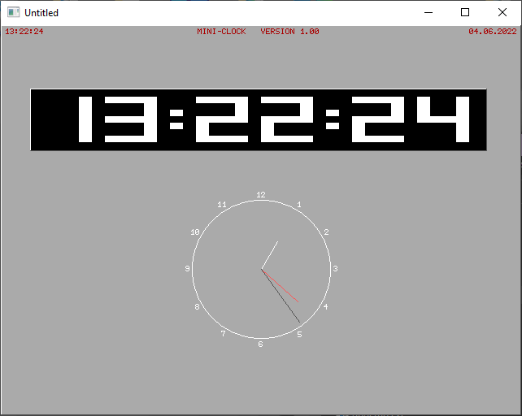

[Home](https://qb64.com) • [News](../../news.md) • [GitHub](https://github.com/QB64Official/qb64) • [Wiki](https://github.com/QB64Official/qb64/wiki) • [Samples](../../samples.md) • [InForm](../../inform.md) • [GX](../../gx.md) • [QBjs](../../qbjs.md) • [Community](../../community.md) • [More...](../../more.md)

## SAMPLE: MINI CLOCK



### Author

[🐝 Folker Fritz](../folker-fritz.md) 

### Description

```text
'    Release: MINI-CLOCK by Folker Fritz
'    Version: 1.0 (1999-10-31)
'     Status: 100% Freeware
'      EMail: folker.fritz@gmx.de
'   Homepage: http://www.quickbasic.6x.to
```

### File(s)

* [mclock.bas](src/mclock.bas)
* [mclock_orig.bas](src/mclock_orig.bas)

🔗 [clock](../clock.md), [desktop](../desktop.md)
