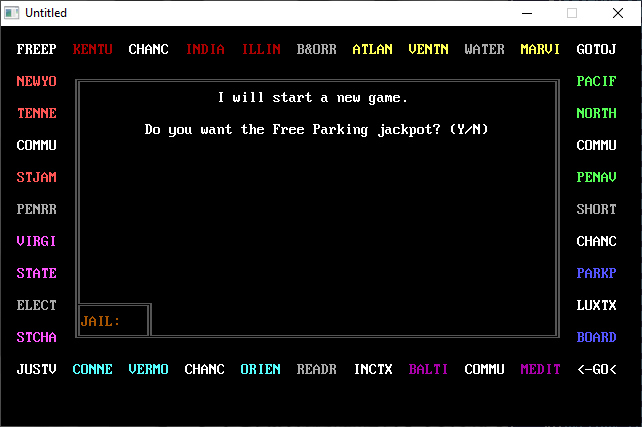

[Home](https://qb64.com) • [News](../../news.md) • [GitHub](https://github.com/QB64Official/qb64) • [Wiki](https://github.com/QB64Official/qb64/wiki) • [Samples](../../samples.md) • [InForm](../../inform.md) • [GX](../../gx.md) • [QBjs](../../qbjs.md) • [Community](../../community.md) • [More...](../../more.md)

## SAMPLE: MONOPOLY CUSTOM



### Author

[🐝 grahambhg](../grahambhg.md) 

### Description

```text
This version of monopoly allows several house rules:(y/n choice for each) free parking jackpot , sell back houses/hotels at full price,  unmortgage interest, unlimited houses/hotels, land on go bonus, and beep on bad input.

It also has a larger board, and three new options: trading, quick inventories, and deed viewing.

When you are raising cash, it shows how much you need/have.

Everything happens on the board now.

Sorry: no trading to raise cash, no choosing the spot for an odd building, only one save slot, no comments in code.

Any other questions? grahambhg@yahoo.com
```

### QBjs

> Please note that QBjs is still in early development and support for these examples is extremely experimental (meaning will most likely not work). With that out of the way, give it a try!

* [LOAD "monopoly.bas"](https://qbjs.org/index.html?src=https://qb64.com/samples/monopoly-custom/src/monopoly.bas)
* [RUN "monopoly.bas"](https://qbjs.org/index.html?mode=auto&src=https://qb64.com/samples/monopoly-custom/src/monopoly.bas)
* [PLAY "monopoly.bas"](https://qbjs.org/index.html?mode=play&src=https://qb64.com/samples/monopoly-custom/src/monopoly.bas)

### File(s)

* [monopoly.bas](src/monopoly.bas)
* [monopoly.zip](src/monopoly.zip)

🔗 [game](../game.md), [monopoly](../monopoly.md), [legacy](../legacy.md)
