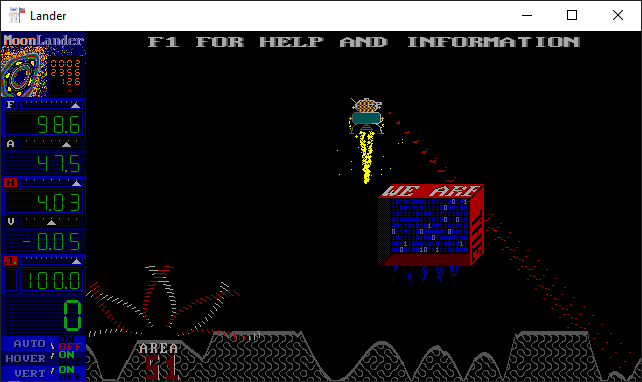

[Home](https://qb64.com) • [News](../../news.md) • [GitHub](../../github.md) • [Wiki](../../wiki.md) • [Samples](../../samples.md) • [Media](../../media.md) • [Community](../../community.md) • [Rolodex](../../rolodex.md) • [More...](../../more.md)

## SAMPLE: MOON LANDER



### Author

[🐝 Richard Frost](../richard-frost.md) 

### Description

```text
Lunar Lander based on a 1974 program running on a DEC PDP/11 with GT40 vector display terminal at the University of Alberta.  Initially written in QB4.5 (hence the convoluted code to save space), upgraded to use some QB64 features.  Updated May 15, 2020 -  More effects (at warp speeds) and cookies!

Controls:
The multifarious keyboard controls are given by pressing F1 (Help) when the program is run.
```

### File(s)

* [l64.bas](src/l64.bas)
* [l64.zip](src/l64.zip)

🔗 [game](../game.md), [lander](../lander.md)


<sub>Reference: [qb64forum](https://qb64forum.alephc.xyz/index.php?topic=2615.0) </sub>
