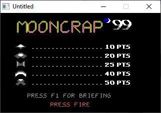
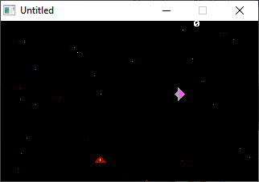

[Home](https://qb64.com) • [News](../../news.md) • [GitHub](https://github.com/QB64Official/qb64) • [Wiki](https://github.com/QB64Official/qb64/wiki) • [Samples](../../samples.md) • [InForm](../../inform.md) • [GX](../../gx.md) • [QBjs](../../qbjs.md) • [Community](../../community.md) • [More...](../../more.md)

## SAMPLE: MOONCRAP



### Author

[🐝 Daniel Kupfer](../daniel-kupfer.md) 

### Description

```text
- - - Mooncrap 1999 - - -
-
- written by Daniel Kupfer
- Runs in Qbasic / QUICK BASIC 4.5
- 

Controls:

move left  = left  arrow / NUM 4  (use NUM 4)
move right = right arrow / NUM 6  (use NUM 6)
fire laser = left Strg
S          = Toggle Sound
P          = Pause Game
```

### QBjs

> Please note that QBjs is still in early development and support for these examples is extremely experimental (meaning will most likely not work). With that out of the way, give it a try!

* [LOAD "mooncr.bas"](https://qbjs.org/index.html?src=https://qb64.com/samples/mooncrap/src/mooncr.bas)
* [RUN "mooncr.bas"](https://qbjs.org/index.html?mode=auto&src=https://qb64.com/samples/mooncrap/src/mooncr.bas)
* [PLAY "mooncr.bas"](https://qbjs.org/index.html?mode=play&src=https://qb64.com/samples/mooncrap/src/mooncr.bas)

### File(s)

* [mooncr.bas](src/mooncr.bas)
* [mooncr.zip](src/mooncr.zip)

### Additional Image(s)



🔗 [game](../game.md), [space invaders](../space-invaders.md), [legacy](../legacy.md)
