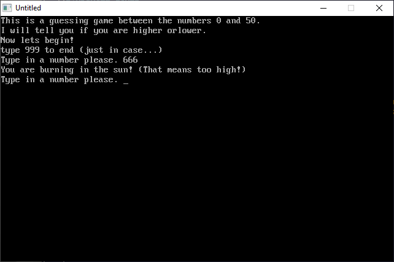

[Home](https://qb64.com) • [News](../../news.md) • [GitHub](https://github.com/QB64Official/qb64) • [Wiki](https://github.com/QB64Official/qb64/wiki) • [Samples](../../samples.md) • [InForm](../../inform.md) • [GX](../../gx.md) • [QBjs](../../qbjs.md) • [Community](../../community.md) • [More...](../../more.md)

## SAMPLE: MRGUESSIT



### Author

[🐝 John Mendoza](../john-mendoza.md) 

### Description

```text
PRINT "This is a guessing game between the numbers 0 and 50."
PRINT "I will tell you if you are higher orlower."
```

### QBjs

> Please note that QBjs is still in early development and support for these examples is extremely experimental (meaning will most likely not work). With that out of the way, give it a try!

* [LOAD "mrguessit.bas"](https://qbjs.org/index.html?src=https://qb64.com/samples/mrguessit/src/mrguessit.bas)
* [RUN "mrguessit.bas"](https://qbjs.org/index.html?mode=auto&src=https://qb64.com/samples/mrguessit/src/mrguessit.bas)
* [PLAY "mrguessit.bas"](https://qbjs.org/index.html?mode=play&src=https://qb64.com/samples/mrguessit/src/mrguessit.bas)

### File(s)

* [mrguessit.bas](src/mrguessit.bas)

🔗 [game](../game.md), [legacy](../legacy.md)
