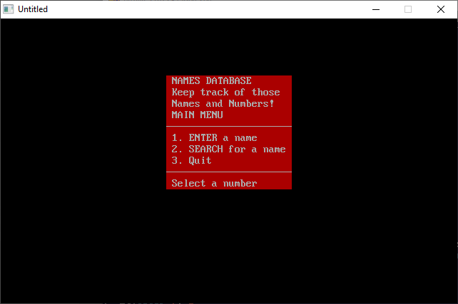

[Home](https://qb64.com) • [News](../../news.md) • [GitHub](https://github.com/QB64Official/qb64) • [Wiki](https://github.com/QB64Official/qb64/wiki) • [Samples](../../samples.md) • [InForm](../../inform.md) • [GX](../../gx.md) • [QBjs](../../qbjs.md) • [Community](../../community.md) • [More...](../../more.md)

## SAMPLE: NAMES



### Author

[🐝 David Bannon](../david-bannon.md) 

### Description

```text
'  NAMES.BAS by David Bannon
'  Copyright (C) 1992 DOS Resource Guide
'  Published in Issue #6, November 1992, page 65
'

==============================================================================

-------------
 NAMES.BAS
 NAMES.BAT
 INSTALL.BAT
-------------
SYSTEM REQUIREMENTS:
The version of QBasic that comes with DOS 5 or later, or Microsoft Quick Basic 
4.x.  Two companion files, INSTALL.BAT and NAMES.BAT (both of which are on 
this diskette), simplify installing and starting NAMES.BAS.

WHAT NAMES.BAS DOES:
This QBasic program lets you create a simple database of companies, contact 
names, and telephone numbers. You can search the database by company name or 
by first or last name.  PHONE.BAS on this diskette performs a similar
function.

USING NAMES.BAS:
You can follow the standard QBasic procedures for starting NAMES.BAS, but 
you'll probably find it more convenient to use NAMES.BAS with its companion 
files, INSTALL.BAT and NAMES.BAT.

INSTALL.BAT simplifies installation, copying NAMES.BAS from its current 
location to your C:\DOS subdirectory. INSTALL.BAT also places NAMES.BAT, the 
batch file used to start NAMES.BAS, in your hard disk's root directory.

When you type NAMES at the DOS prompt, NAMES.BAT changes to your \DOS 
directory, starts QBasic, and runs NAMES.BAS. NAMES.BAS presents you with 
three options: entering a name, searching for a name, or quitting the program. 
When you press 1 to choose the first option, NAMES.BAS prompts you to enter 
the name, area code, phone number, and company name for each entry. If you 
type END (any combination of upper- and lowercase number is acceptable) in the 
last-name field, the program closes the file and returns you to the main menu.

When you press 2 to select the search option, the program asks you to supply 
the name you want to look for. When a match is found, NAMES.BAS prints all the 
database entries that match your criteria. The program informs you if no match 
exists and repeats its request for a name. As with the first option, typing 
END returns you to the main menu.

Choose option 3 from the main menu to quit the program.

For further details on NAMES.BAS, see "Building a QBasic Database" (DRG #6, 
November 1992, page 65).
```

### QBjs

> Please note that QBjs is still in early development and support for these examples is extremely experimental (meaning will most likely not work). With that out of the way, give it a try!

* [LOAD "names.bas"](https://qbjs.org/index.html?src=https://qb64.com/samples/names/src/names.bas)
* [RUN "names.bas"](https://qbjs.org/index.html?mode=auto&src=https://qb64.com/samples/names/src/names.bas)
* [PLAY "names.bas"](https://qbjs.org/index.html?mode=play&src=https://qb64.com/samples/names/src/names.bas)

### File(s)

* [names.bas](src/names.bas)
* [names.zip](src/names.zip)

🔗 [data management](../data-management.md), [dos world](../dos-world.md)
