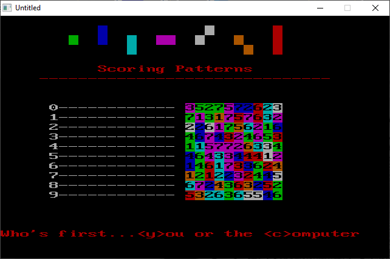

[Home](https://qb64.com) • [News](../../news.md) • [GitHub](https://github.com/QB64Official/qb64) • [Wiki](https://github.com/QB64Official/qb64/wiki) • [Samples](../../samples.md) • [InForm](../../inform.md) • [GX](../../gx.md) • [QBjs](../../qbjs.md) • [Community](../../community.md) • [More...](../../more.md)

## SAMPLE: NUMBER BLASTER



### Author

[🐝 R. K. Fink](../r.-k.-fink.md) 

### Description

```text
' NUMBER BLASTER/BLASTER.BAS
' R. K. Fink  9/14/94
' Copyright (C) 1994 DOS World Magazine
' Published in Issue #19, January 1995, page 56

***************************************************************************** 
 
 BLASTER.BAS 
   by R. K. Fink 
 Copyright (C) 1994 DOS World Magazine 
 Published in Issue #19, January 1995, page 56 
 
BLASTER.BAS is an entertaining strategy game that pits you against the  
computer.  You and your PC take turns blasting away at a 10-by-10 grid of  
numbers, racking up points as you go.  But to come out the winner, you can't  
just shoot from the hip -- you have to plan your attack. 
 
To run the program from the DOS command line, change to the directory  
containing BLASTER.BAS, then type: 
 
QBASIC /RUN BLASTER 
 
The program waits for you to press a key to indicate you are ready to begin  
play, then asks you whether you want to go first or let your computer make  
the opening move.  Your chances of winning the game are improved if you go  
first. Before you make your first move, take a few moments to study the 
screen.  At the top is a collection of colored shapes labeled Scoring 
Patterns.  In the center is the game board consisting of multicolored 
squares on which numbers are superimposed.  The game board's ten rows are 
numbered 0 through 9.  When it is your turn, a message appears at the 
bottom of the screen, prompting you to enter a row number. 
 
The object of the game is to get the highest score.  The color of the first  
square in the row you select determines the pattern of squares used to  
compute your score for that move.  Each of the seven possible colors  
corresponds to one of the seven scoring patterns shown at the top of the  
screen.  For example, if you type in the number of a row that begins with a  
white square, the pattern consists of the white square, plus the square  
immediately to its upper right.  If you type in the number of a row that  
begins with a red square, the scoring pattern consists of the red square,  
plus the squares immediately above and below the red square.  The score for  
your move is the sum of the numbers in the scoring pattern determined by the  
color of the first square in the row you select. 
 
When you select a row, the squares in your scoring pattern disappear, and  
your score is increased by the sum of the numbers in the scoring pattern.   
Then it's the computer's turn.  You alternate, taking turns with the computer  
until all of the squares are blasted away.  The highest score wins. 
 
Try it: you'll catch on after a few moves.  Be careful, though.  To win, you  
need to think before you act.  Sometimes, making the choice that gives you  
the highest score for that move is not the best strategy, because it uncovers  
patterns that will give the computer an even higher score.  The program keeps  
a running score to tell you who's ahead.
```

### QBjs

> Please note that QBjs is still in early development and support for these examples is extremely experimental (meaning will most likely not work). With that out of the way, give it a try!

* [LOAD "blaster.bas"](https://qbjs.org/index.html?src=https://qb64.com/samples/number-blaster/src/blaster.bas)
* [RUN "blaster.bas"](https://qbjs.org/index.html?mode=auto&src=https://qb64.com/samples/number-blaster/src/blaster.bas)
* [PLAY "blaster.bas"](https://qbjs.org/index.html?mode=play&src=https://qb64.com/samples/number-blaster/src/blaster.bas)

### File(s)

* [blaster.bas](src/blaster.bas)

🔗 [game](../game.md), [dos world](../dos-world.md)
