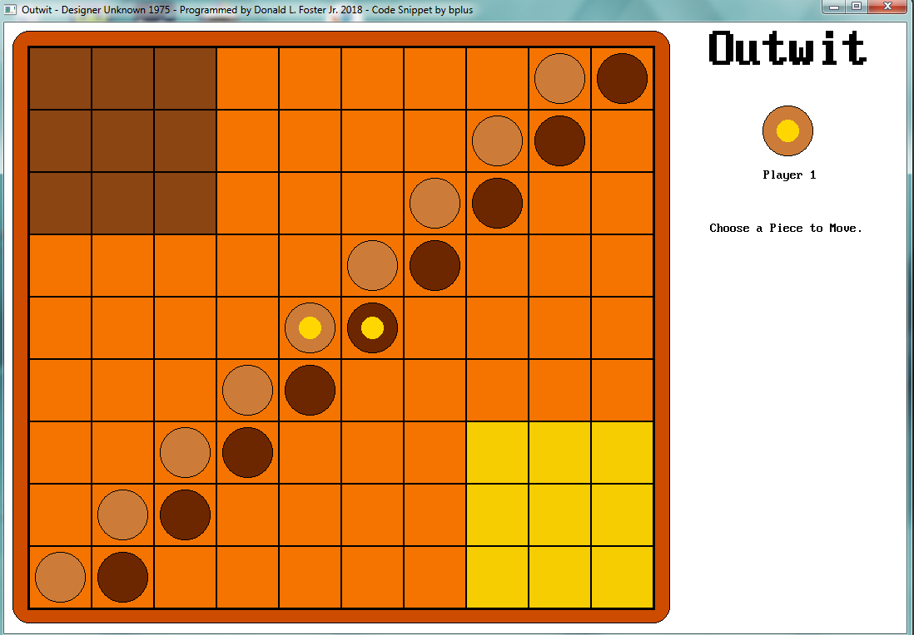

[Home](https://qb64.com) • [News](../../news.md) • [GitHub](https://github.com/QB64Official/qb64) • [Wiki](https://github.com/QB64Official/qb64/wiki) • [Samples](../../samples.md) • [InForm](../../inform.md) • [GX](../../gx.md) • [QBjs](../../qbjs.md) • [Community](../../community.md) • [More...](../../more.md)

## SAMPLE: OUTWIT



### Author

[🐝 Donald Foster](../donald-foster.md) 

### Description

```text
I've complete another game I wrote on the Tandy 2000 about 30 years ago. Outwit is a 2 player board game.

From the instruction sheet:
"EQUIPMENT: 1 playing board with 90 squares, including two corners of 9 squares each. 18 chips (9 dark and 9 light), one chip on each side has a dot on it, called the "power chip".
OBJECT: To be the first to slide all nine of your chips into your own corner of the board."
The chips are setup in the middle of the board at start. Each player plays alternately one chip in one direction only. a regular chip may move horizontally or vertically only. A power chip may move also diagonally. A regular chip must slide as far as it can go. Stopped only by reaching the edge of the board, another chip or the opponent's corner. A power chip can stop whenever it wants, but must stop for the same reasons as a regular chip.
```

### QBjs

> Please note that QBjs is still in early development and support for these examples is extremely experimental (meaning will most likely not work). With that out of the way, give it a try!

* [LOAD "outwit.bas"](https://qbjs.org/index.html?src=https://qb64.com/samples/outwit/src/outwit.bas)
* [RUN "outwit.bas"](https://qbjs.org/index.html?mode=auto&src=https://qb64.com/samples/outwit/src/outwit.bas)
* [PLAY "outwit.bas"](https://qbjs.org/index.html?mode=play&src=https://qb64.com/samples/outwit/src/outwit.bas)

### File(s)

* [outwit.bas](src/outwit.bas)

🔗 [game](../game.md)


<sub>Reference: [qb64forum](https://qb64forum.alephc.xyz/index.php?topic=125.0) </sub>
