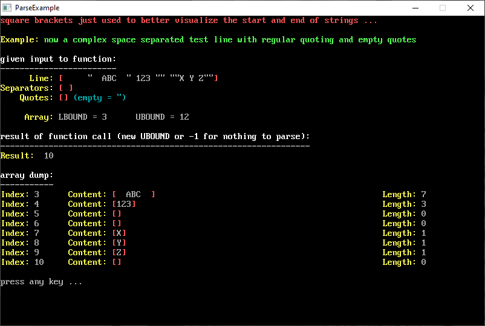

[Home](https://qb64.com) • [News](../../news.md) • [GitHub](https://github.com/QB64Official/qb64) • [Wiki](https://github.com/QB64Official/qb64/wiki) • [Samples](../../samples.md) • [InForm](../../inform.md) • [GX](../../gx.md) • [QBjs](../../qbjs.md) • [Community](../../community.md) • [More...](../../more.md)

## SAMPLE: PARSELINE



### Author

[🐝 Rho Sigma](../rho-sigma.md) 

### Description

```text
I guess every developer is sooner or later in need of such a parsing function: Doesn't matter if it's to split a simple text line into its single words, quickly reading CSV data into an array, break up a path specification into the single folder names or get the individual options of a given command line or of an URL query string.

Obviously such a function must be able to recognize several separator chars and needs to be able to suppress the splitting of components in quoted sections. Special to this function is the ability to optionally use different chars for opening quotes and closing quotes, which e.g. allows to read out sections in parenthesis or brackets.

For usage, see the full description available in separate HTML document (compressed file).
```

### QBjs

> Please note that QBjs is still in early development and support for these examples is extremely experimental (meaning will most likely not work). With that out of the way, give it a try!

* [LOAD "parseexample.bas"](https://qbjs.org/index.html?src=https://qb64.com/samples/parseline/src/parseexample.bas)
* [RUN "parseexample.bas"](https://qbjs.org/index.html?mode=auto&src=https://qb64.com/samples/parseline/src/parseexample.bas)
* [PLAY "parseexample.bas"](https://qbjs.org/index.html?mode=play&src=https://qb64.com/samples/parseline/src/parseexample.bas)

### File(s)

* [parseexample.bas](src/parseexample.bas)
* [parseline.zip](src/parseline.zip)

🔗 [data management](../data-management.md), [parsing](../parsing.md)


<sub>Reference: [qb64forum](https://qb64forum.alephc.xyz/index.php?topic=4188.0) </sub>
