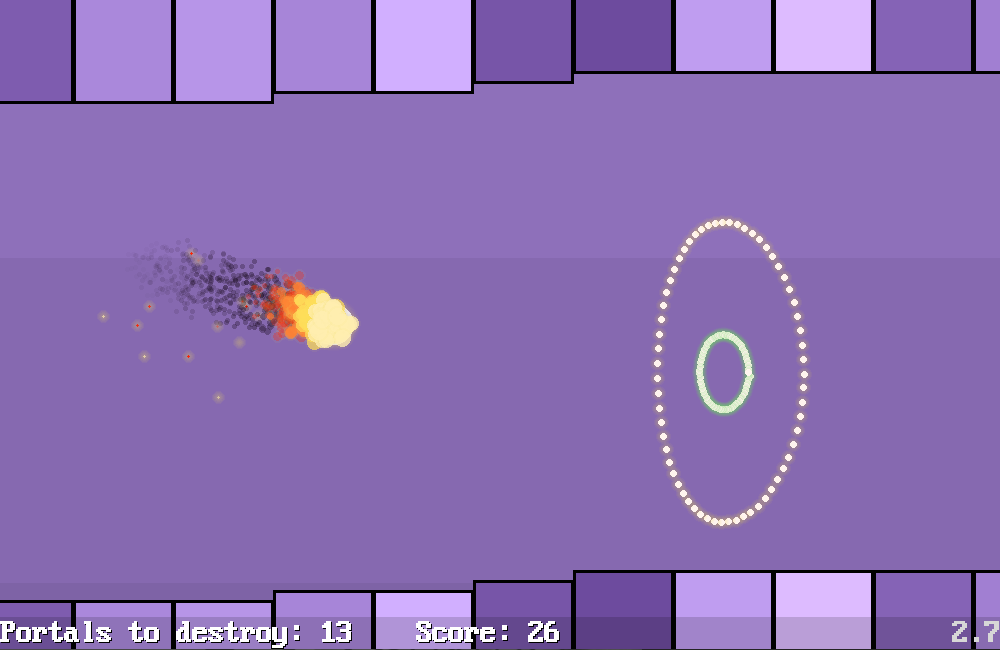

[Home](https://qb64.com) • [News](../../news.md) • [GitHub](https://github.com/QB64Official/qb64) • [Wiki](https://github.com/QB64Official/qb64/wiki) • [Samples](../../samples.md) • [InForm](../../inform.md) • [GX](../../gx.md) • [QBjs](../../qbjs.md) • [Community](../../community.md) • [More...](../../more.md)

## SAMPLE: PENDULUM GAME



### Author

[🐝 Fellippe Heitor](../fellippe-heitor.md) 

### Description

```text
My attempt at creating something drawing inspiration from Fire Rides by Voodoo. Made with QB64.
```

### QBjs

> Please note that QBjs is still in early development and support for these examples is extremely experimental (meaning will most likely not work). With that out of the way, give it a try!

* [LOAD "pendulum.bas"](https://qbjs.org/index.html?src=https://qb64.com/samples/pendulum-game/src/pendulum.bas)
* [RUN "pendulum.bas"](https://qbjs.org/index.html?mode=auto&src=https://qb64.com/samples/pendulum-game/src/pendulum.bas)
* [PLAY "pendulum.bas"](https://qbjs.org/index.html?mode=play&src=https://qb64.com/samples/pendulum-game/src/pendulum.bas)

### File(s)

* [pendulum-master.zip](src/pendulum-master.zip)
* [pendulum.bas](src/pendulum.bas)

🔗 [game](../game.md), [pendulum](../pendulum.md)


<sub>Reference: [github.com](https://github.com/FellippeHeitor/Pendulum) </sub>
