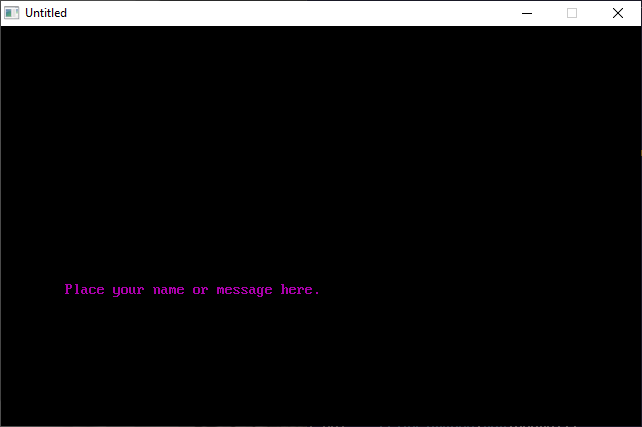

[Home](https://qb64.com) • [News](../../news.md) • [GitHub](https://github.com/QB64Official/qb64) • [Wiki](https://github.com/QB64Official/qb64/wiki) • [Samples](../../samples.md) • [InForm](../../inform.md) • [GX](../../gx.md) • [QBjs](../../qbjs.md) • [Community](../../community.md) • [More...](../../more.md)

## SAMPLE: PERSONAL



### Author

[🐝 Tim Syrop](../tim-syrop.md) 

### Description

```text
' PERSONAL.BAS
'   by Tim Syrop
' Copyright (C) 1995 DOS World
' Published in Issue #22, March 1995, page 66

***************************************************************************** 
 
 PERSONAL.BAS 
   by Tim Syrop 
 Copyright (C) 1995 DOS World 
 Published in Issue #22, March 1995, page 66 
 
PERSONAL.BAS is a screen saver that you can customize with your own personal  
message.  PERSONAL.BAS won't start automatically like commercial screen  
savers, but you can activate it quickly whenever you will be leaving your  
computer for a while. 
 
To run the program from the DOS command line, change to the directory  
containing PERSONAL.BAS, then type: 
 
QBASIC /RUN PERSONAL 
 
 
The screen will clear, and the program will display its message on the screen  
for two seconds.  Then, the message will be erased and displayed again in  
another color at a randomly selected screen location. Pressing any key will  
exit the program and return you to the DOS command line after printing a  
message telling you hoe many minutes the screen saver was active. 
 
After you've run the program to see how it works, you'll want to customize it  
with your own message. With PERSONAL.BAS loaded into QBasic, move to the  
following line: 
 
NAME$ = "Place your name or message here." 
 
Now, replace the message between the quotation marks with one of your own.   
Save the revised program, and run it whenever you want to leave you computer  
with a personal message displayed on the screen.
```

### QBjs

> Please note that QBjs is still in early development and support for these examples is extremely experimental (meaning will most likely not work). With that out of the way, give it a try!

* [LOAD "personal.bas"](https://qbjs.org/index.html?src=https://qb64.com/samples/personal/src/personal.bas)
* [RUN "personal.bas"](https://qbjs.org/index.html?mode=auto&src=https://qb64.com/samples/personal/src/personal.bas)
* [PLAY "personal.bas"](https://qbjs.org/index.html?mode=play&src=https://qb64.com/samples/personal/src/personal.bas)

### File(s)

* [personal.bas](src/personal.bas)

🔗 [screensaver](../screensaver.md), [dos world](../dos-world.md)
