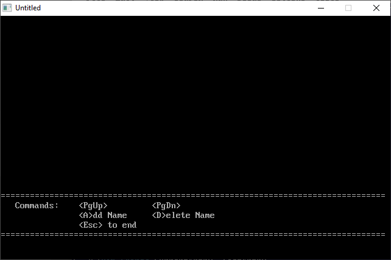

[Home](https://qb64.com) • [News](../../news.md) • [GitHub](https://github.com/QB64Official/qb64) • [Wiki](https://github.com/QB64Official/qb64/wiki) • [Samples](../../samples.md) • [InForm](../../inform.md) • [GX](../../gx.md) • [QBjs](../../qbjs.md) • [Community](../../community.md) • [More...](../../more.md)

## SAMPLE: PHONE



### Author

[🐝 Hardin Brothers](../hardin-brothers.md) 

### Description

```text
'
'  PHONE.BAS by Hardin Brothers
'  Copyright (C) 1992 DOS Resource Guide
'  Published in Issue # 4, page 63
'

==============================================================================

-----------
 PHONE.BAS
-----------
SYSTEM REQUIREMENTS:
The version of QBasic that comes with DOS 5 or later, or Microsoft Quick Basic 
4.x.

WHAT PHONE.BAS DOES:
This easy-to-use QBasic database gives you quick access to important phone 
numbers, organizing them by last name or company name.  NAMES.BAS on this
diskette performs a similar function.

USING PHONE.BAS:
To load the program, type QBASIC PHONE.BAS (using path names if necessary) at 
the DOS prompt. Then run the program by selecting the Start option in QBasic's 
Run menu, or press Shift-F5.

A menu at the bottom of your screen offers five choices: PgUp, PgDn, Add a 
Name, Delete a Name, and Esc. To enter names and phone numbers, press A (Add a 
Name). At the prompts, enter a last name, first name, and a phone number, 
pressing Enter after each one. After you complete each database entry, 
PHONE.BAS assigns it a number and displays the page containing the entry on 
screen. The program organizes entries alphabetically by last name.

To delete an entry, press D at the main menu. The program prompts you to type 
the number of the entry to remove and asks you to confirm your intention to 
delete it. After erasing the entry, the program displays the current page of 
database entries, renumbering entries as necessary.

Use the PgUp and PgDn keys to move from page to page. To exit the program, 
press Esc from the main menu.

For further details on PHONE.BAS, see "Elementary Steps to Programming" (DRG 
#4, page 63).
```

### QBjs

> Please note that QBjs is still in early development and support for these examples is extremely experimental (meaning will most likely not work). With that out of the way, give it a try!

* [LOAD "phone.bas"](https://qbjs.org/index.html?src=https://qb64.com/samples/phone/src/phone.bas)
* [RUN "phone.bas"](https://qbjs.org/index.html?mode=auto&src=https://qb64.com/samples/phone/src/phone.bas)
* [PLAY "phone.bas"](https://qbjs.org/index.html?mode=play&src=https://qb64.com/samples/phone/src/phone.bas)

### File(s)

* [phone.bas](src/phone.bas)
* [phone.zip](src/phone.zip)

🔗 [data management](../data-management.md), [dos world](../dos-world.md)
